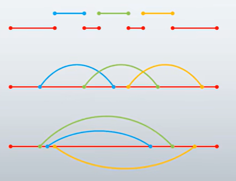

# 委托

C#中委托等同于C++中的函数指针。主要目的是能够将方法像参数一样传递。
C#默认提供了两种委托类型，一种为`Action`，另一种为`Func`。

委托是一种类（class），类是数据类型，所以委托也是一种数据类型。
它的声明方式与一般的类不同，主要是为了照顾可读性和C/C++传统
注意声明委托的位置，避免写错地方结果声明成嵌套类型。
委托与所封装的方法必须“类型兼容”，即返回值的数据类型一致 参数列表在个数和数据类型上一致（参数名不需要这样）

其示例代码如下：

``` csharp
using System;
using System.Collections.Generic;

namespace DelegateExample
{
    class Program
    {
        static void Main(string[] args)
        {
            Calculator calculator = new Calculator();
            // 委托方式一，适用方法无返回值
            Action action = new Action(calculator.Report);
            // 直接调用（非委托方式）
            calculator.Report();
            // 委托方式一，两种调用方法
            acion.Invoke();
            action();
            
            // 委托方式二，适用方法有输入，无返回值时则是Func<int, int, null>，第三个int改为null即可。
            Func<int, int, int> func1 = new Func<int, int, int>(calculator.Add);
            Func<int, int, int> func2 = new Func<int, int, int>(calculator.Sub);
            
            int x = 100;
            int y = 200;
            int z = 0;
            // 调用方法1
            z = func1(x, y);
            Console.WriteLine(z);
            // 调用方法2
            z = func2.Invoke(x, y);
            Console.WriteLine(z);
        }
    }
    class Calculator
    {
        public void Report()
        {
            Console.WriteLine("I have 3 methods.");
        }
        
        public int Add(int a, int b)
        {
            int result = a + b;
            return result;
        }
        
        public int Sub(int a, int b)
        {
            int result = a - b;
            return result;
        }
    }
}
```


自定义委托例程：
``` csharp
using System;
using System.Collections.Generic;

namespace DelegateExample
{
    public delegate double Calc(double x, double y);

    class Program
    {
        static void Main(string[] args)
        {
            Calculator calculator = new Calculator();
            Calc calc1 = new Calc(calculator.Add);
            Calc calc2 = new Calc(calculator.Sub);
            Calc calc3 = new Calc(calculator.Mul);
            Calc calc4 = new Calc(calculator.Div);
            
            double a = 100;
            double b = 200;
            double c = 0;
            
            c = calc1.Invoke(a, b);
            Console.WriteLine(c);
            c = calc2.Invoke(a, b);
            Console.WriteLine(c);
            c = calc3(a, b);
            Console.WriteLine(c);
            c = calc3(a, b);
            Console.WriteLine(c);
        }
    }
    class Calculator
    {
        public double Add(double a, double b)
        {
            return a + b;
        }
        
        public double Sub(double a, double b)
        {
            return a - b;
        }
        
        public double Mul(double a, double b)
        {
            return a * b;
        }
        
        public double Div(double a, double b)
        {
            return a / b;
        }
    }
}
```

委托的一般使用
实例：把方法当作参数传给另一个方法
正确使用1：模板方法，“借用”指定的外部方法来产生结果
        相当于填空题，常位于代码中部，委托有返回值
正确使用2：回调（callback）方法，调用指定的外部方法
        相当于流水线，常位于代码末尾，委托无返回值

注意：难精通+易使用+功能强大的东西，一旦被滥用则后果非常严重
缺点1：这是一种方法级别的紧耦合，显示工作中要慎之又慎
缺点2：可读性下降，debug的难度增加
缺点3：把委托回调、异步调用和多线程纠缠在一起，会让代码变得难以阅读和维护
缺点4：委托使用不当有可能造成内存泄漏和程序性能下降

模板方法和回调方法的示例
``` csharp
using System;
using System.Collections.Generic;

namespace DelegateExample
{
    class Program
    {
        static void Main(string[] args)
        {
            ProductFactory productFactory = new ProductFactory();
            WrapFactory wrapFactory = new WrapFactory();
            Func<Product> func1 = new Func<Product>(productFactory.MakePizza);
            Func<Product> func2 = new Func<Product>(productFactory.MakeTopCar);
            
            Logger logger = new Logger();
            Action<Product> log = new Action<Product>(logger.Log);
            
            WrapFactory wrapFactory = new WrapFactory();
            Box box = wrapFactory.WrapProduct(func1, log);
            Console.WriteLine(box.Product.Name);
            box = wrapFactory.WrapProduct(func2, log);
            Console.WriteLine(box.Product.Name);
        }
    }
    
    class Logger
    {
        public void log(Product product)
        {
            Console.WriteLine("Product '{0}' created at {1}, price is {2}.", product.Name, DateTime.UtcNow, product.Price);
        }
    }
    
    class Product
    {
        public string Name { get; set; }
        public double Price { get; set; }
    }
    
    class Box
    {
        public Product Product { get; set; }
    }
    
    class WrapFactory
    {
        public Box WrapProduct(Func<Product> getProduct, Action<Product> logCallback)
        {
            Box box = new Box();
            Product product = getProduct.Invoke();
            box.Product = product;
            if (product.Price >= 50)
            {
                logCallback(product);
            }
            return box;
        }
    }
    
    class ProductFactory
    {
        public Product.MakePizza()
        {
            Product product = new Product();
            product.Name = "Pizza";
            product.Price = 12;
            return product;
        }
        
        public Product MakeTopCar()
        {
            Product product = new Product();
            product.Name = "Toy Car";
            product.Price = 100;
            return product;
        }
    }
}
```

委托的高级使用
多播（multicast）委托
- 隐式异步调用
    - 同步和异步的简介
        - 中英文的语言差异
        - 同步：你做完了我（在你的基础上）接着做
        - 异步：咱们两个同时做（相当于汉语中的“同步进行”）
    - 同步调用和异步调用的对比
        - 每一个运行的程序是一个进程（process）
        - 每个进程可以有一个或者多个线程（thread）
        - 同步调用是在同一线程内
        - 异步调用的底层机理是多线程
        - 串行==同步==单线程，并行==异步==多线程
    - 隐式多线程 V.S. 显式多线程
        - 直接同步调用：使用方法名
        - 间接同步调用：使用单播/多播委托的Invoke方法
        - 隐式异步调用：使用委托的BeginInvoke
        - 显式异步调用：使用Thread或Task
- 应当适时地使用接口（interface）取代一些对委托的使用
    - Java完全使用接口取代了委托的功能，即Java没有与C#中委托相对应的功能实体




``` csharp
using System;
using System.Collections.Generic;
using System.Threading;

namespace MulticastDelegateExample
{
    class Program
    {
        static void Main(string[] args)
        {
            Student stu1 = new Student() { ID = 1; PenColor = ConsoleColor.Yellow };
            Student stu2 = new Student() { ID = 2; PenColor = ConsoleColor.Green };
            Student stu3 = new Student() { ID = 3; PenColor = ConsoleColor.Red };
            Action action1 = new Action(stu1.DoHomework);
            Action action2 = new Action(stu2.DoHomework);
            Action action3 = new Action(stu3.DoHomework);
            
            action1 += action2;
            action1 += action3;
            
            // 只调用委托1，便相当于同时调用了委托1、2、3，同时执行顺序按照添加的前后顺序进行。此便为多播委托
            action1.Invoke();
        }
    }
    
    class Student
    {
        public int ID { get; set; }
        public ConsoleColor PenColor { get; set; }
        
        public void DHomework()
        {
            for (int i = 0; i < 5; i++)
            {
                Console.ForegroundColor = this.PenColor;
                Console.WriteLine("Student {0} doing homework {1} hours(s).", this.ID, i);
                Thread.Sleep(1000);
            }
        }
    }
}
```

以上例程都是同步调用。也就是单线程执行调用，调用委托时会阻塞之前的进程，等待委托方法结束后才会继续下去。

隐式异步调用的例程如下所示：
``` csharp
using System;
using System.Collections.Generic;
using System.Threading;

namespace MulticastDelegateExample
{
    class Program
    {
        static void Main(string[] args)
        {
            Student stu1 = new Student() { ID = 1; PenColor = ConsoleColor.Yellow };
            Student stu2 = new Student() { ID = 2; PenColor = ConsoleColor.Green };
            Student stu3 = new Student() { ID = 3; PenColor = ConsoleColor.Red };
            Action action1 = new Action(stu1.DoHomework);
            Action action2 = new Action(stu2.DoHomework);
            Action action3 = new Action(stu3.DoHomework);
            
            action1.BeginInvoke(null, null);
            action2.BeginInvoke(null, null);
            action3.BeginInvoke(null, null);
        }
    }
    
    class Student
    {
        public int ID { get; set; }
        public ConsoleColor PenColor { get; set; }
        
        public void DHomework()
        {
            for (int i = 0; i < 5; i++)
            {
                Console.ForegroundColor = this.PenColor;
                Console.WriteLine("Student {0} doing homework {1} hours(s).", this.ID, i);
                Thread.Sleep(1000);
            }
        }
    }
}
```

显式异步调用的例程如下所示：
``` csharp
using System;
using System.Collections.Generic;
using System.Threading;

namespace MulticastDelegateExample
{
    class Program
    {
        static void Main(string[] args)
        {
            Student stu1 = new Student() { ID = 1; PenColor = ConsoleColor.Yellow };
            Student stu2 = new Student() { ID = 2; PenColor = ConsoleColor.Green };
            Student stu3 = new Student() { ID = 3; PenColor = ConsoleColor.Red };
            
            // 方式一
            Thread thread1 = new Thread(new ThreadStart(stu1.DoHomework));
            Thread thread2 = new Thread(new ThreadStart(stu2.DoHomework));
            Thread thread3 = new Thread(new ThreadStart(stu3.DoHomework));
            
            thread1.Start();
            thread2.Start();
            thread3.Start();
            
            // 方式二
            Task task1 = new Task(new Action(stu1.DoHomework));
            Task task2 = new Task(new Action(stu2.DoHomework));
            Task task3 = new Task(new Action(stu3.DoHomework));
            
            task1.start();
            task2.start();
            task3.start(); 
        }
    }
    
    class Student
    {
        public int ID { get; set; }
        public ConsoleColor PenColor { get; set; }
        
        public void DHomework()
        {
            for (int i = 0; i < 5; i++)
            {
                Console.ForegroundColor = this.PenColor;
                Console.WriteLine("Student {0} doing homework {1} hours(s).", this.ID, i);
                Thread.Sleep(1000);
            }
        }
    }
}
```

委托能实现的功能，接口也能实现。（Java里面没有委托，接口完全替代了委托的功能）如无必要，少用委托。

以下为接口的使用实例
``` csharp
using System;
using System.Collections.Generic;
using System.Threading;

namespace DelegateExample
{
    class Program
    {
        static void Main(string[] args)
        {
            IProductFactory pizzaFactory = new PizzaFactory();
            IProductFactory toycarFactory = new ToyCarFactory();
            WrapFactory wrapFactory = new WrapFactory();

            Box box1 = wrapFactory.WrapProduct(pizzaFactory);
            Box box2 = wrapFactory.WrapProduct(toycarFactory);
            
            Console.WriteLine(box1.Product.Name);
            Console.WriteLine(box2.Product.Name);
        }
    }
    
    // 定义接口
    interface IProductFactory
    {
        Product Make();
    }
    
    class PizzaFactory : IProductFactory
    {
        public Product Make()
        {
            Product product = new Product();
            product.Name = "Pizza";
            return product;
        }
    }
    
    class ToyCarFactory:IProductFactory
    {
        public Product Make()
        {
            Product product = new Product();
            product.Name = "Toy Car";
            return product;
        }
    }
    
    class Product
    {
        public string Name { get; set; }
    }
    
    class Box
    {
        public Product Product { get; set; }
    }
    
    class WrapFactory
    {
        public Box WrapProduct(IProductFactory productFactory)
        {
            Box box = new Box();
            Product product = productFactory.Make();
            box.Product = product;
            return box;
        }
    }
}
```

