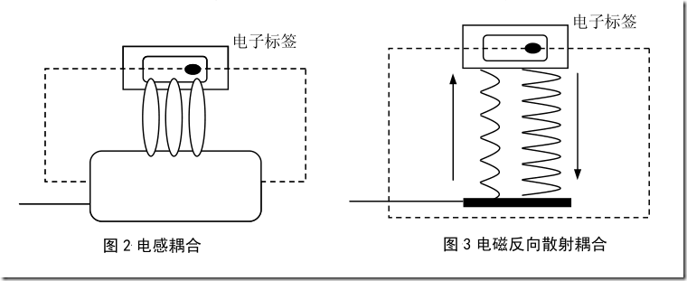
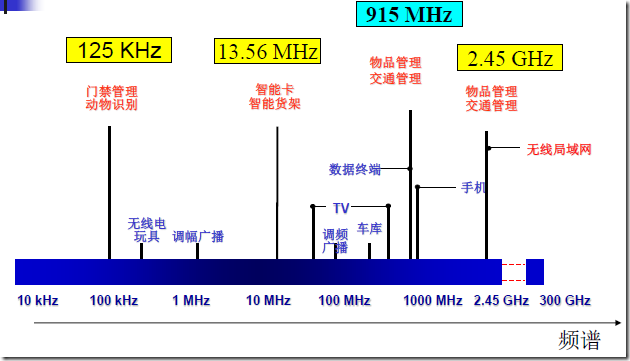

# UHF频段的RFID方案调研

## 射频信号的耦合
阅读器和电子标签之间的射频信号的耦合类型有两种：
- 电感耦合。变压器模型，通过空间高频交变磁场实现耦合，依据的是电磁感应定律。
- 电磁反向散射耦合。雷达原理模型，发射出去的电磁波，碰到目标后反色，同时携带回目标信息，依据的是电磁波的空间传播规律。

|             |           电感耦合            |         电磁方向散射耦合          |
| :---------: | :--------------------------: | :-----------------------------: |
|    模型     |           变压器模型           |           雷达原理模型           |
|    原理     |          电磁感应定律          |       电磁波的空间传播规律        |
| 典型工作距离 |           10~20cm            |              3~10m              |
| 典型工作频率 |   125KHz, 225KHz, 13.56MHz   | 443MHz, 915MHz, 2.45GHz, 5.8GHz |
|    标签     | 具有环形天线的典型低频、高频标签 |   具有双极天线的超高频和微波标签   |

针对上述两种耦合方式而采用的两种调制方式为负载调制和反向散射调制。

## RFID频率
RFID典型的工作频率有125KHz、133KHz、13.56MHz、27.12MHz、433MHz、860~960MHz、2.45GHz、5.8GHz等。按照工作频率不同，RFID系统集中在低频、高频和超高频三个区域。

频率越高，传播距离越远，但绕射或穿透能力较弱。
双频RFID系统主要应用于距离要求较远、多卡识别和高速识别的场合，如：供应链管理、人员流动跟踪、动物跟踪与识别、采矿作业和地下路网管理及运动计时等。

## RFID频段规划
各国在这一频段的频段规划和使用情况各不相同：
欧洲使用的超高频是865~868MHz；
美国是902~928MHz；
日本是952~954MHz。
但都集中在860~960MHz之内。
`我国UHF频段试行使用频率为840~845MHz和920~925MHz`

我国860MHz~960MHz频段的频率使用情况

| 集群通信下行频段 | 数据通信频段  |   CDMA下行    |   GSM-E频段   |    GSM上行    |  无中心对讲机  | 立体声广播传输和航空导航（次要） |  航空导航业务  |  GSM下行频段   |
| :------------: | :----------: | ------------- | ------------- | ------------- | ------------- | ---------------------------- | ------------- | ------------- |
| 851MHz~866MHz  | 866MH~869MHz | 870MHz~880MHz | 880MHz~885MHz | 885MHz~915MHz | 915MHz~917MHz | 917MHz~925MHz                | 925MHz~930MHz | 930MHz~960MHz |

## RFID芯片厂家

### 国外厂家
[IMPINJ](https://www.impinj.com/)，全球领先的超高频Gen2 RFID解决方案供应商。
超高频芯片：INDY R500（190标签/秒）、INDY R2000（900标签/秒）。协议：ISO 18000-63、EPCglobal Gen2v2 compliant。频段：840~960MHz。

### 国产厂家
- [上海坤锐电子科技有限公司](http://www.quanray.com/)，是亚洲第一家、全球第四家通过EPC Global芯片兼容性/标签互操作性双重认证公司。
超高频芯片：Qstar-5U、Qstar-5R、Qstar-5X、Qstar-6T、Qstar-7X
高频芯片

- [北京中电华大电子设计有限责任公司](http://www.hed.com.cn/cn/index.aspx)，连续三年蝉联“中国最有影响力物联网安全企业奖”，主打物联网安全芯片。主要业务面向金融、物联网支付。
高频芯片：SHC1101、SHC1104、SHC1108、CIU51L80。通信协议：ISO/IEC 14443
