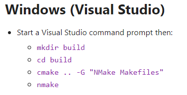
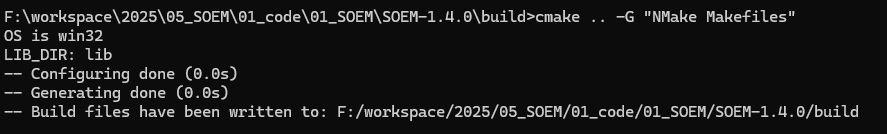
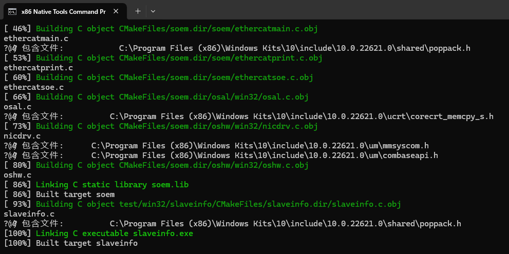

# 01_Windows平台编译SOEM

首先，SOEM源码下载地址：[SOEM下载地址](https://github.com/OpenEtherCATsociety/SOEM)
以及WinPcap的环境依赖：[WinPcap官网地址](https://www.winpcap.org/)
CMake和NMake一般电脑内装好Visual Studio之后都会自带，只需用everything搜索到即可。如果后续打开命令行界面后，输入cmake或者nmake发现没有，可以使用如下指令进行添加：
``` bash
set path=%path%;C:\Program Files\Microsoft Visual Studio\2022\Community\Common7\IDE\CommonExtensions\Microsoft\CMake\CMake\bin
```
其中`%path%`特指原先的path路径，这样就达到了在原先path内容后添加，而不是直接覆盖。

在下载好的SOEM中查看CMakeLists.txt，可以看到第一行的指定版本号。这里我们可以根据自己的CMake的版本号进行修改，比如修改为以下内容：
``` cmake
cmake_minimum_required(VERSION 2.8.4...3.29.5)
```
cmake版本号可以通过`cmake --version`指令进行查看。

还是CMakeLists.txt文件，查看最后几行内容，原文如下：
``` cmake
if(BUILD_TESTS) 
  add_subdirectory(test/linux/slaveinfo)
  add_subdirectory(test/linux/eepromtool)
  add_subdirectory(test/linux/simple_test)
endif()
```
这里我们注释掉原来的三行内容，并添加一行，修改后如下。

``` cmake
if(BUILD_TESTS) 
  #add_subdirectory(test/linux/slaveinfo)
  #add_subdirectory(test/linux/eepromtool)
  #add_subdirectory(test/linux/simple_test)
  add_subdirectory(test/win32/slaveinfo)
  add_subdirectory(test/win32/eepromtool)
  add_subdirectory(test/win32/simple_test)
endif()
```

然后我们进入`.\test\win32\slaveinfo`文件路径下，新建一个CMakeLists.txt文件，并输入以下内容：
``` cmake
set(SOURCES slaveinfo.c)
add_executable(slaveinfo ${SOURCES})
target_link_libraries(slaveinfo soem)
install(TARGETS slaveinfo DESTINATION bin)
```

同理，eepromtool和simple_test也可以参考上面添加。其实这些文件在`.\test\linux\`相对应的路径下都有，检查一下也可以直接复制过来用。
最后，需要打开simple_test.c文件，查看340行，也就是`OSAL_THREAD_FUNC ecatcheck(void *lpParam)`函数的return结束代码行，将`return 0;`改为`return ;`。如下所示：

``` C
//DWORD WINAPI ecatcheck( LPVOID lpParam )
OSAL_THREAD_FUNC ecatcheck(void *lpParam)
{
    int slave;

    while(1)
    {
        if( inOP && ((wkc < expectedWKC) || ec_group[currentgroup].docheckstate))
        {
            if (needlf)
            {
               needlf = FALSE;
               printf("\n");
            }
            /* one ore more slaves are not responding */
            ec_group[currentgroup].docheckstate = FALSE;
            ec_readstate();
            for (slave = 1; slave <= ec_slavecount; slave++)
            {
               if ((ec_slave[slave].group == currentgroup) && (ec_slave[slave].state != EC_STATE_OPERATIONAL))
               {
                  ec_group[currentgroup].docheckstate = TRUE;
                  if (ec_slave[slave].state == (EC_STATE_SAFE_OP + EC_STATE_ERROR))
                  {
                     printf("ERROR : slave %d is in SAFE_OP + ERROR, attempting ack.\n", slave);
                     ec_slave[slave].state = (EC_STATE_SAFE_OP + EC_STATE_ACK);
                     ec_writestate(slave);
                  }
                  else if(ec_slave[slave].state == EC_STATE_SAFE_OP)
                  {
                     printf("WARNING : slave %d is in SAFE_OP, change to OPERATIONAL.\n", slave);
                     ec_slave[slave].state = EC_STATE_OPERATIONAL;
                     ec_writestate(slave);
                  }
                  else if(ec_slave[slave].state > EC_STATE_NONE)
                  {
                     if (ec_reconfig_slave(slave, EC_TIMEOUTMON))
                     {
                        ec_slave[slave].islost = FALSE;
                        printf("MESSAGE : slave %d reconfigured\n",slave);
                     }
                  }
                  else if(!ec_slave[slave].islost)
                  {
                     /* re-check state */
                     ec_statecheck(slave, EC_STATE_OPERATIONAL, EC_TIMEOUTRET);
                     if (ec_slave[slave].state == EC_STATE_NONE)
                     {
                        ec_slave[slave].islost = TRUE;
                        printf("ERROR : slave %d lost\n",slave);
                     }
                  }
               }
               if (ec_slave[slave].islost)
               {
                  if(ec_slave[slave].state == EC_STATE_NONE)
                  {
                     if (ec_recover_slave(slave, EC_TIMEOUTMON))
                     {
                        ec_slave[slave].islost = FALSE;
                        printf("MESSAGE : slave %d recovered\n",slave);
                     }
                  }
                  else
                  {
                     ec_slave[slave].islost = FALSE;
                     printf("MESSAGE : slave %d found\n",slave);
                  }
               }
            }
            if(!ec_group[currentgroup].docheckstate)
               printf("OK : all slaves resumed OPERATIONAL.\n");
        }
        osal_usleep(10000);
    }

    return ;
}
```

保存完成之后即可开始编译。
电脑搜索并打开x86 Native Tools Command Prompt for VS 2022。注意：普通cmd窗口无法实现编译，此窗口下的环境依赖可能会有区别。

在此窗口下依然需要验证cmake和nmake有没有效，如果无效请参考本文开头的方式进行临时添加依赖路径。添加好后请再次进行验证cmake和nmake。确保有效之后即可进行编译流程。

通过SOEM根目录下的README.md里面，已经说明编译流程，我们进入SOEM根目录后照做即可：

如无意外，即可顺利编译完成。




同时也可以去检查`\build\test\win32\slaveinfo\`路径下是否成功生成`slaveinfo.exe`文件，如果成功生成，也可以说明编译成功。

最后需要注意的是，前面安装和编译的过程都不需要管理员权限，但是运行例程的时候需要管理员权限方可运行，否则会导致无法连接从站的情况。提示为无法运行pcap。
