# Gitlab和NuGet包引用和发布详细介绍

## 一、简介

本文档将详细介绍基于Gitlab的包引用和发布内容，预期的成果将如下所示：

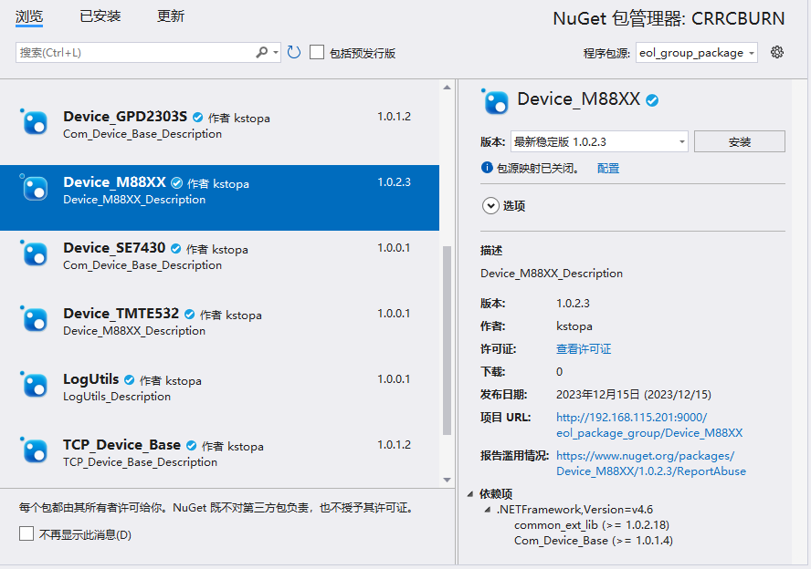

如图所示，仪器库代码可以通过gitlab进行NuGet的包管理和发布，实现更加方便的代码管理和库的调用。

官方的相关文档可以通过此链接查阅：[https://docs.gitlab.com/16.6/ee/ci/yaml/](https://docs.gitlab.com/16.6/ee/ci/yaml/)

简要的概括下流程：
- 本地代码改动
- 变动代码推送到Gitlab上
- Gitlab将这个变动通知Gitlab-CI
- Gitlab-CI找出这个工程相关联的gitlab-runner
- gitlab-runner把代码更新到本地
- 根据预设值的条件配置好环境
- 根据预定义的脚本（`.gitlab-ci.yml`）执行
- 把执行结果通知给Gitlab
- Gitlab显示最终执行结果

### 1.1 环境准备

首先，在做整个流程之前，需要提前准备一些软件和环境。

1. Git，此项用于拉取和上传代码库
2. TortoiseGit，git管理工具（可选）
3. VSCode/notepad++，修改文件内容（可选）
4. NuGetPackageExplorer（6.0.64），用于修改NuGet的`nuspec`后缀的文件，[下载地址](https://github.com/NuGetPackageExplorer/NuGetPackageExplorer/releases/)
5. gitlab-runner-windows-386（16.4.1），用于运行gitlab的本地runner。[下载地址](https://gitlab-runner-downloads.s3.amazonaws.com/v16.4.1/index.html)
6. Nuget，nuget包工具。[下载地址](https://dist.nuget.org/win-x86-commandline/latest/nuget.exe)
7. release-cli，gitlab发布(release)命令行(command-line)工具。[下载地址](https://gitlab.com/api/v4/projects/gitlab-org%2Frelease-cli/packages/generic/release-cli/latest/release-cli-windows-amd64.exe)

其中，第6项和第7项为调用依赖，需要自行保存到C盘路径下并添加路径到系统变量中，这里我保存的路径为`C:\Program Files\nuget`。
第5项为主要运用的工具，通过第5项的工具来调用第6项和第7项的工具。最好也放在C盘，这里我的路径为`C:\github_runner`。

### 1.2 基础知识

本教程所需要用到的知识如下。仅有部分内容会有所讲解，其他如果不熟悉请自行上网了解。

- Git使用
- powershell的脚本编写
- nuget批处理命令
- nuget package explorer 打包文件生成工具

## 二、环境搭建

### 2.1 gitlab-runner

首次运行gitlab-runner会自动引导配置，runners的名字可以自己命名，url为gitlab地址，为`http://192.168.115.201:9000`，token为密钥，executor选择shell。配置完成后会在gitlab-runner路径下生成config.toml文件，在这里可以看到之前配置的详细信息。
可以通过everything搜索本机的power shell的原始名称是powershell还是pwsh，配置后默认为pwsh，如果出现找不到pwsh可以改成powershell尝试。

### 2.2 仓库搭建

首先在gitlab上新建一个空白项目。并勾选使用自述文件初始化仓库（默认为勾选上的）。
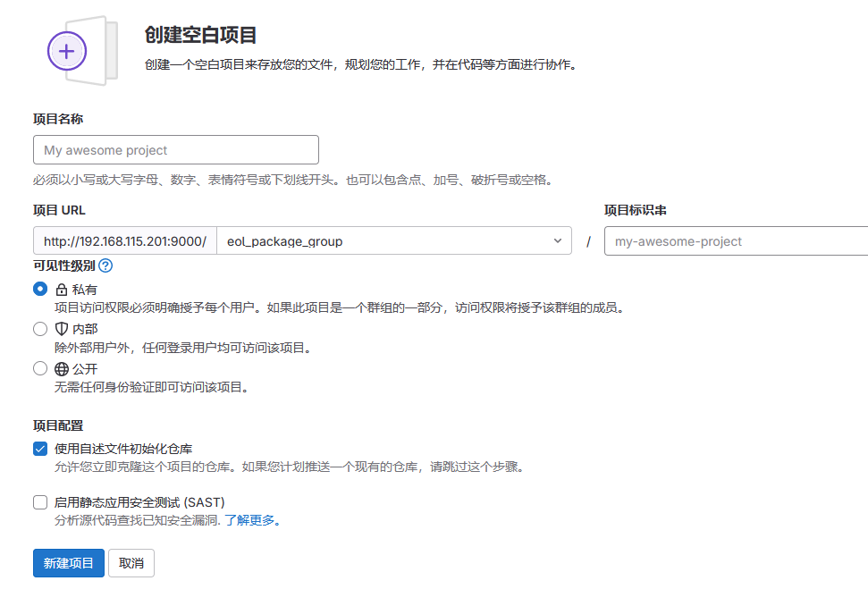

进入项目->设置->CI/CD，为该项目设置或分配runner。此runner的标签需和2.1中设置的runner名称一致

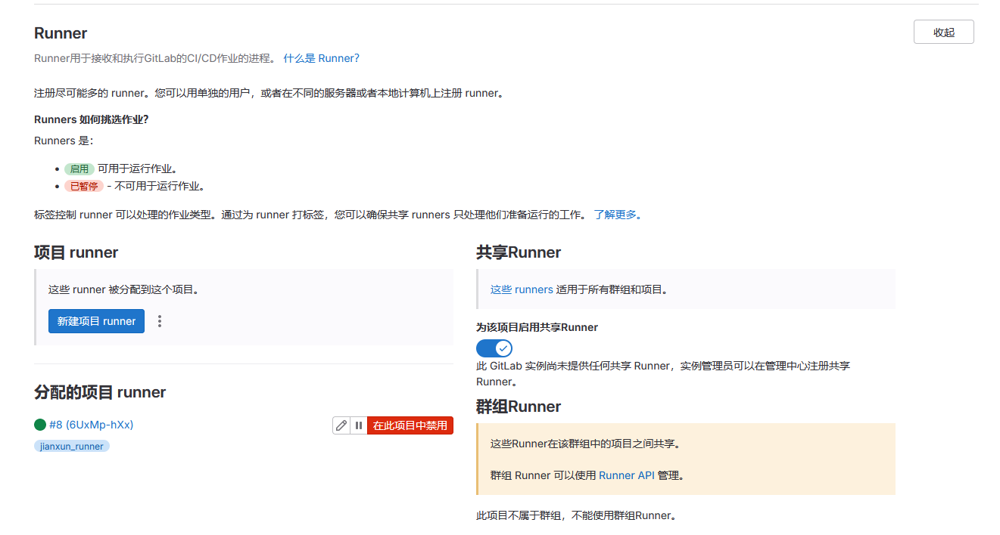

在设置->仓库->部署令牌中添加令牌，令牌的密钥只会显示一次，忘记则需要重新添加新的令牌。

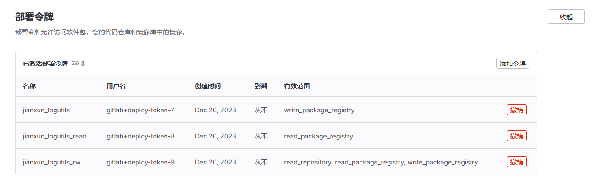

添加令牌后，可以在CI/CD将令牌的用户名和密钥添加到设置->CI/CD->变量中，使其更加方便的调用。（项目组中的令牌和变量都已经部署好，开发者无需也没有权限进入设置页面）


## 三、项目上传

### 3.1 上传文件范围

一般情况下，上传到代码库中的只有工程文件、代码文件、README、Properties文件夹以及其他配置文件。其余的`packages`文件夹、`bin`文件夹、`obj`文件夹和`.vs`文件夹这些编译器生成的文件都不允许上传到仓库中。以节省服务器的资源占用。

目录结构可参考 `Device_TI2000`。

### 3.2 配置文件

#### 3.2.1 nuspec配置

在项目文件路径下，可以看到后缀为`nuspec`的文件，每一个新建项目都需要修改这份文件以实现自动打包的流程。

这里参考一段 `Device_TI2000.nuspec` 的文件来解析。

``` xml
<?xml version="1.0" encoding="utf-8"?>
<package xmlns="http://schemas.microsoft.com/packaging/2012/06/nuspec.xsd">
  <metadata>
    <id>Device_TI2000</id>
    <version>1.0.0.1</version>
    <title></title>
    <authors>kstopa</authors>
    <owners></owners>
    <requireLicenseAcceptance>false</requireLicenseAcceptance>
    <license type="expression">MIT</license>
    <readme>readme.md</readme>
    <projectUrl>http://192.168.115.201:9000/eol_package_group/Device_TI2000</projectUrl>
    <description>Device_TI2000_Description</description>
    <releaseNotes></releaseNotes>
    <copyright>$copyright$</copyright>
    <dependencies>
      <group targetFramework=".NETFramework4.6">
        <dependency id="common_ext_lib" version="1.0.4.21" />
        <dependency id="TCP_Device_Base" version="1.0.1.2" />
      </group>
    </dependencies>
  </metadata>
  <files>
    <file src="bin\release\CRC_LIB.dll" target="lib\net46\CRC_LIB.dll" />
    <file src="bin\release\Device_TI2000.dll" target="lib\net46\Device_TI2000.dll" />
    <file src="readme.md" target="readme.md" />
  </files>
</package>
```

可以看到该文件的文件格式为xml格式，里面有项目名称（id），项目路径（projectUrl），项目说明（description），项目依赖（dependencies），项目文件（files）等等。

其中，项目依赖和项目文件可以删除，不同的项目可以通过NuGetPackageExplorer软件进行配置。在删除files和dependencies后，用软件打开此文件。可以看到以下界面：

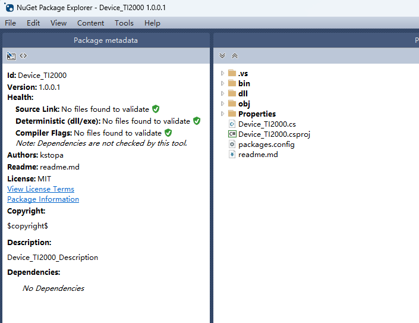

右侧的文件可以添加删除选择生成的文件，这里我们全部删除。然后右键选择 `Add Lib Folder`，在Lib文件夹上再右键选择Add .Net Framework folder->v4.6。当然这个项目底层依托你实际项目中所使用的框架。这里我们都是Framework的底层。所有项目都默认使用4.6的版本，以满足win7到win11等等新旧各主机的兼容性。

包括后续的新建项目，也都以4.6版本优先配置与生成。

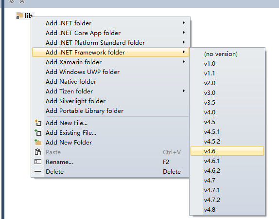

然后在net46上右键选择Add Existing File，这里的文件选择项目生成的release文件，并且有且仅有该项目新独立引用以及新生成的文件，不包含调用的库等文件，如果有特殊的环境依赖或者安装需求，请在Readme文档中说明清楚。

比如Device_TI2000生成的Release文件中，dll文件有四个，由于common_ext_lib和TCP_Device_Base都是调用的其他库，这里不需要添加进来，CRC_LIB文件是该项目单独引用的dll文件，这里需要添加，并且加上该项目本身生成的文件`Device_TI2000.dll`，所以一共有两个文件需要添加进来。如下图所示。

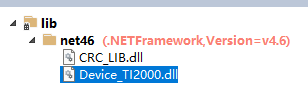

那么，这里需要调用的其他库是如何添加呢，首先可以看到左上角有一个按钮，可以通过此按钮进入描述编辑界面。点开此界面后，最下方有Edit dependencies按钮，点击此按钮会弹出一个窗口，通过该窗口可以实现其他库的调用。

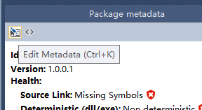

在该界面，首先我们点击左上角添加一个分组，然后再上方写明framework的版本号为net46，这样分组的标题也就改成了net46，然后最下方有两个文本框，左侧为其他库的库名，右侧为版本号，这里的信息我们可以通过打开项目文件的`packages.config`这个文件，里面详细说明了该项目所调用的外部库的库名和版本以及framework的版本名。

文件中targetframework应当都是net46版本，如果不是，请检查项目属性，查看该项目所设置的版本。修改版本后删除所有引用并重新引用以及编译，即可解决此问题。

在下方的文本框输入好一个库的信息后，点击右侧的加号，即可添加到上面的分组中，待所有引用的外部库全都添加完成后，点击OK即可。

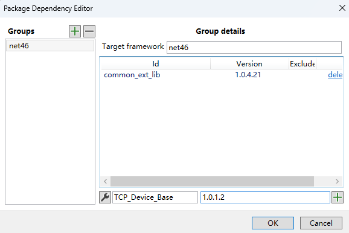

在退回上一界面后，再点击左上角勾号，完成配置信息。此时，我们所修改的nuspec文件并不会完成自动修改，需要我们手动覆盖保存，这里我们点击File->Save Metadata As 完成保存并覆盖。

在保存完成后，用记事本或者notepad++或者VSCode之类的工具打开此文件，修改files的文件路径，将所有的文件路径的前面的src的路径的前缀`lib\net46`都修改为`bin\release`路径，然后保存文件即可。

至此，再检查一遍该文件，id、projectUrl、description都需要符合该项目的名称或路径。否则可能会导致生成失败。

#### 3.2.2 yml配置

在项目的根目录中，可以看到还有一个`.gitlab-ci.yml`的文件，该文件已经配置完成，为实现自动打包的主要配置文件。在组的项目中可以不作任何修改，但如果是自己的私有项目中，则需要对该文件做适当改动。

主要修改路径为第82行的用户名和密钥，这个需要配合上文2.2中提到的部署令牌。其他的不需要做任何改动。

### 3.3 运行github_runner

通过powershell窗口运行github_runner程序，并挂在后台。

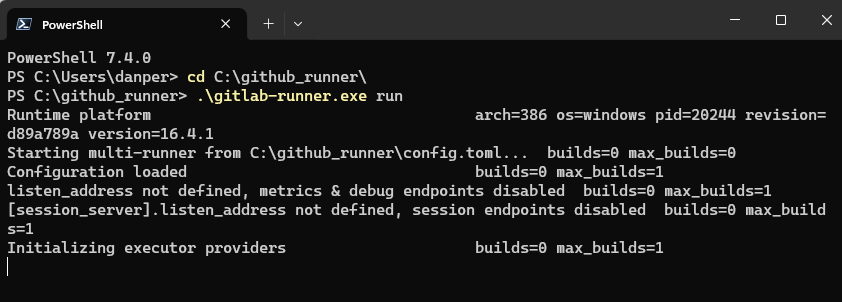

### 3.4 上传项目

在项目文件编译且配置完成后，便可以新建并提交至新建分支，这里需要注意的是，开发者对组内的项目是没有权限直接修改或者增删main主分支的内容的，只能新建并提交到新分支后，再合并到main分支里面。

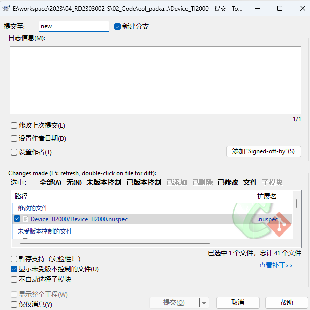

上传后，如果你的github_runner的程序挂在后台，gitlab便会自动执行编译指令，用来检查上传的代码有没有编译错误。

当全部配置并检查完成后，便可以在代码->标签页面新建标签，标签名必须为`vX.X.X`(v1.0.0)的格式，其中v必须要小写，X代表数字，代表此次打包的版本。在打包完成后，版本格式会变成`vX.X.X.X`(v1.0.0.1)，此版本号为最终生成的版本号，最后一个数字代表第几次打包。

新建标签后，可以通过构建->流水线来查看打包的状态。如下图所示。

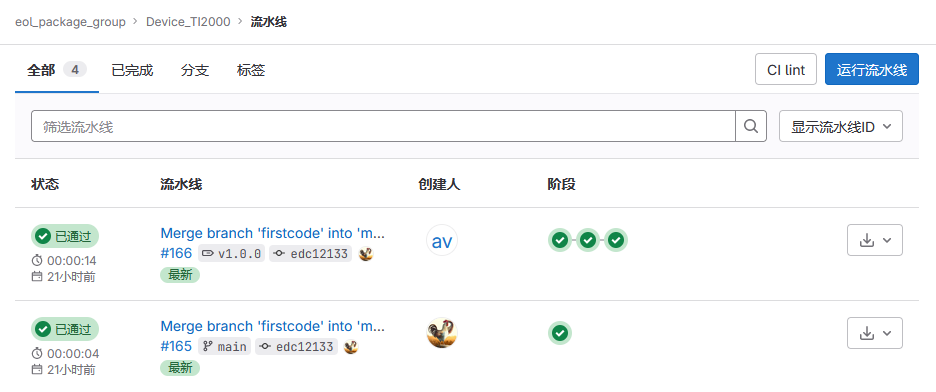

在打包完成后，便可以配置你电脑上的nuget来使用这些包了。正常情况下，如果通过你电脑打包的项目，VS里面也会自动完成调用。但如果你是需要使用该库的电脑。或者说打包后VS里面的nuget没有完成调用，也可以打开cmd窗口，输入以下指令即可该组的调用。

``` shell
dotnet nuget add source http://192.168.189.22:9000/api/v4/groups/21/-/packages/nuget/index.json --name "eol_group_package" --username "gitlab+deploy-token-5" --password "38pz1edAKnTRa1iQqusJ" --store-password-in-clear-text --allow-insecure-connections
```

完成调用后的效果如第一场图所示。

备注：包在使用时，更新或者引用时出现更新不了，提示异常（具体根据异常情况决定），有些时候需要清空Nuget缓存，在tools->options->nuget包管理常规中，清除缓存。
