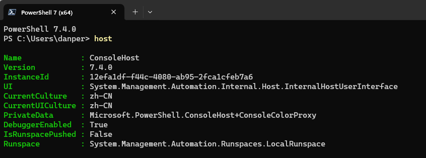

# gitlab的包引用和发布

visualstudio引用本地搭建的nuget库可能会有问题，如下图：


显示用户名格式不正确，但是该格式是可以用指令完成增加与连接的。
首先需要删除添加好的路径与链接，并清空nugui缓存。
然后打开cmd界面，输入指令即可完成增加：

``` shell
dotnet nuget add source http://192.168.115.201:9000/api/v4/groups/21/-/packages/nuget/index.json --name "eol_group_package" --username "gitlab+deploy-token-5" --password "38pz1edAKnTRa1iQqusJ" --store-password-in-clear-text --allow-insecure-connections
```


常见问题：

问题1：
"pwsh": executable file not found in %PATH%

解决方案：
更新powershell版本到7.4版本（最新版本），下载网址：[powershell releases发布地址](https://github.com/PowerShell/powershell/releases)

问题2：
The term 'nuget' is not recognized as a name of a cmdlet, function, script file, or executable program. Check the spelling of the name, or if a path was included, verify that the path is correct and try again.

powershell未找到nuget，首先需要下载nuget，[下载网址，点击链接直接下载](https://dist.nuget.org/win-x86-commandline/latest/nuget.exe)
然后将nuget.exe存放到C盘路径下，比如我这里存放到`C:\nuget\`的路径下。然后在系统环境变量的path里面添加此路径后重启电脑即可。
然后打开下载的powershell7的版本，注意，cmd指令打开的依然是系统自带的powershell7，不是下载的最新的版本，查询powershell版本可以通过输入`$psversiontable`或者`host`的指令获得。



问题3：
报错提示没有找到setApiKey密钥：


表示没有创建部署令牌，需要到gitlab-》项目-》设置-》仓库-》部署令牌下新建部署令牌。
部署令牌只会显示一次，忘记就需要重新新建部署令牌。


我这里的部署令牌用户名和密码分别为：


```
//不清楚这个能不能用
gitlab+deploy-token-7
a8vn4m6K6G_aZJxzEYwj

gitlab+deploy-token-9
JG4aafZRukSsoyvodHfv
```

访问的令牌用户名和密码分别为：

```
令牌ID：jianxun_logutils_read
用户名：gitlab+deploy-token-8
密码：PR6e887JMskQRDK_NtNX
```

在`.gitlab-ci.yml`文件中添加用户名和密钥即可解决问题：

```
dotnet nuget add source $source_url --name $source_name --username "$env:jianxun_logutils_rw_key" --password "$env:jianxun_logutils_rw_password" --store-password-in-clear-text --allow-insecure-connections
```

问题4：


常用预设变量表

|               变量名称               | 描述                                                                                                                                                            |
| :---------------------------------: | :------------------------------------------------------------------------------------------------------------------------------------------------------------- |
|            CI_BUILDS_DIR            | 构建时的最顶层目录                                                                                                                                               |
|          CI_COMMIT_AUTHOR           | 提交的作者，格式为：名称<邮箱>                                                                                                                                    |
|        CI_COMMIT_BEFORE_SHA         | 当前分支的上一个提交哈希值                                                                                                                                        |
|          CI_COMMIT_BRANCH           | 提交的分支名，在合并流水线和tag流水线时不可见                                                                                                                       |
|        CI_COMMIT_DESCRIPTION        | 提交的描述                                                                                                                                                      |
|          CI_COMMIT_MESSAGE          | 完整的提交信息                                                                                                                                                   |
|         CI_COMMIT_REF_NAME          | 项目的分支名或tag名                                                                                                                                              |
|       CI_COMMIT_REF_PROTECTED       | 如果作业正在构建的是被保护的分支或tag，值为true                                                                                                                     |
|         CI_COMMIT_REF_SLUG          | CI_COMMIT_REF_NAME的小写形式                                                                                                                                    |
|            CI_COMMIT_SHA            | 提交的完整哈希值                                                                                                                                                 |
|         CI_COMMIT_SHORT_SHA         | 8个字符的提交哈希值                                                                                                                                              |
|            CI_COMMIT_TAG            | 提交的tag，仅在tag流水线可见                                                                                                                                      |
|         CI_COMMIT_TIMESTAMP         | 提交时的时间戳                                                                                                                                                   |
|           CI_COMMIT_TITLE           | 提交的标题                                                                                                                                                      |
|          CI_DEFAULT_BRANCH          | 项目的默认分支                                                                                                                                                   |
|          CI_DEPLOY_FREEZE           | 当流水运行是处于部署冻结阶段时可见，值为true                                                                                                                        |
|         CI_ENVIRONMENT_NAME         | 当前作业的部署环境名，当设置了environment:name 时可见                                                                                                              |
|         CI_ENVIRONMENT_URL          | 当前作业的部署环境地址，只有设置了environment:url可见                                                                                                               |
|              CI_JOB_ID              | 当前作业的ID，系统内唯一                                                                                                                                          |
|            CI_JOB_IMAGE             | 当前作业使用的Docker镜像名                                                                                                                                        |
|             CI_JOB_NAME             | 当前作业名称                                                                                                                                                     |
|            CI_JOB_STAGE             | 当前作业所属的阶段名                                                                                                                                              |
|           CI_PIPELINE_ID            | 当前流水线ID（实例级），系统内唯一                                                                                                                                 |
|         CI_PIPELINE_SOURCE          | 流水线触发方式，枚举值为push,web, schedule, api, external, chat, webide,merge_request_event, external_pull_request_event, parent_pipeline, trigger, 或者 pipeline |
|        CI_PIPELINE_TRIGGERED        | 当作业是使用trigger触发的时为true                                                                                                                                 |
|           CI_PIPELINE_URL           | 流水线详情的地址                                                                                                                                                 |
|       CI_PIPELINE_CREATED_AT        | 流水线创建时间                                                                                                                                                   |
|           CI_PROJECT_DIR            | 存放克隆项目的完整路径，作业运行的目录                                                                                                                              |
|           CI_PROJECT_NAME           | 当前项目名称，不包含组名                                                                                                                                          |
|        CI_PROJECT_NAMESPACE         | 项目的命名空间（组名或用户名）                                                                                                                                     |
|           CI_PROJECT_PATH           | 包含项目名称的命名空间                                                                                                                                            |
|          CI_PROJECT_TITLE           | 项目名称（网页上显示的）                                                                                                                                          |
|           CI_PROJECT_URL            | 项目HTTP(S)地址                                                                                                                                                 |
|           CI_RUNNER_TAGS            | 逗号分割的runner标签列表                                                                                                                                         |
|          GITLAB_USER_EMAIL          | 开始当前作业的用户邮箱                                                                                                                                            |
|          GITLAB_USER_LOGIN          | 开始当前作业的登录用户名-拿我格子衫来                                                                                                                              |
|          GITLAB_USER_NAME           | 开始当前作业的用户名                                                                                                                                              |
|      CI_MERGE_REQUEST_APPROVED      | 当合并流水线的MR被通过时值为true                                                                                                                                  |
|     CI_MERGE_REQUEST_ASSIGNEES      | 逗号分割的合并请求指派人列表                                                                                                                                      |
| CI_MERGE_REQUEST_SOURCE_BRANCH_NAME | 合并请求中的源分支名称                                                                                                                                            |
| CI_MERGE_REQUEST_TARGET_BRANCH_NAME | 合并请求中的目标分支名称                                                                                                                                          |
|       CI_MERGE_REQUEST_TITLE        | 合并请求的标题                                                                                                                                                   |


dotnet nuget指令：
add        添加NuGet源
delete    从服务器删除一个包
disable    禁用NuGet源
enable    启用NuGet源
list        列出配置的NuGet源
locals    清除或列出本地NuGet资源，例如http请求缓存、包文件夹、插件操作缓存或计算机范围全局包文件夹
push    将包推送到服务器并发布
remove    移除NuGet源
sign        Signs NuGet packages(s) at <package-path> with the specified certificate.
trust       管理受信任的签名人
update    更新NuGet源
verify    验证已签名的NuGet包

问题5：


