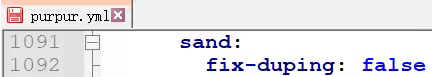

# Purpur开服配置指南

## purpur服务器

相比paper服务端，服务器推荐为purpur服务器，paper服务器对原版特性限制过多，优化了很多bug和限制，不适合作为生电服务器。
purpur基于paper，在保留paper优化同时拥有更多配置。

但不代表所有特性都能正常使用，正常情况下，生电端还是推荐使用fabric+carpet，也就是地毯端，此服务端可以体会到原生的bug来制作生电装置。

官网：[https://purpurmc.org](https://purpurmc.org)

配置说明：[https://purpurmc.org/docs/purpur/configuration/](https://purpurmc.org/docs/purpur/configuration/)


刷沙机等：
```
// 文件：purpur.yml
sand:
    fix-duping: false
    
    safe-teleporting: false
```




RNG附魔等：


