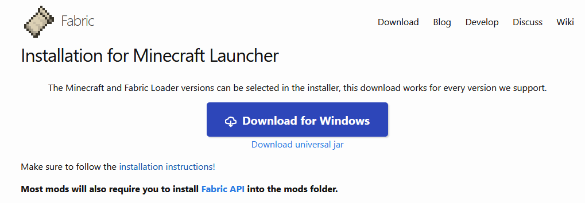

# 地毯服务端开服指南

## 资源准备
首先去官方下载服务端文件。
官方地址：[https://zh.minecraft.wiki/w/Java版1.21?variant=zh-cn](https://zh.minecraft.wiki/w/Java版1.21?variant=zh-cn)

然后去fabric官网下载安装程序。
[https://fabricmc.net/use/installer/](https://fabricmc.net/use/installer/)


如果是Windows平台可以直接点击按钮下载windows端的程序。linux平台可以选择底下的`Download universal jar`进行下载。比如在linux终端输入如下代码：
``` bash
wget https://maven.fabricmc.net/net/fabricmc/fabric-installer/1.0.1/fabric-installer-1.0.1.jar
```

最后去git上下载地毯：[fabric-carpet](https://github.com/gnembon/fabric-carpet/releases)

mc1.21版本除了以上的内容，还需要安装java21。
这里贴一个参考链接：[https://cn.linux-console.net/?p=31573](https://cn.linux-console.net/?p=31573)
里面介绍了两种方式，比较简单一种的方式可以按照如下进行安装和验证：
``` bash
wget https://download.oracle.com/java/21/latest/jdk-21_linux-x64_bin.deb
sudo dpkg -i jdk-21_linux-x64_bin.deb
java --version
```
这里的java安装的主目录为 ` /usr/lib/jvm/jdk-21-oracle-x64/`。

如果系统中已经有java，那么需要查看并列出java所有版本的，可以参考如下：
``` bash
sudo update-alternatives --list java
```

如果需要设置默认的java版本的，可以参考如下设置：
``` bash
sudo update-java-alternatives --set  /usr/lib/jvm/jdk-21-oracle-x64
```

除了以上方式，另一种稍微麻烦一些，通过OpenJDK来安装Java21。
``` bash
# 访问 OpenJDK 21 发行网站并下载适合您的 CPU 架构的版本
wget https://download.java.net/java/GA/jdk21.0.2/f2283984656d49d69e91c558476027ac/13/GPL/openjdk-21.0.2_linux-x64_bin.tar.gz

# 我们可以将下载的文件解压，得到包含OpenJDK的所有文件和目录
tar xvf openjdk-21.0.2_linux-x64_bin.tar.gz

# 将创建的文件夹移动到 /usr/local/ 目录中
sudo mv jdk-21.0.2/ /usr/local/jdk-21

#要设置 Java 环境，请创建一个新的源脚本
sudo tee -a  /etc/profile.d/jdk21.sh<<EOF
export JAVA_HOME=/usr/local/jdk-21
export PATH=\$PATH:\$JAVA_HOME/bin
EOF

# 在当前shell会话中实现更改的源
source /etc/profile.d/jdk21.sh

#检查Java版本验证其是否有效
java --version
```

以上，所有环境全部安装成功。

要想方便更改文件以及后台运行等处理，你可能还需要安装vim和screen之类的软件。
vim用于新建或修改文件配置，screen用于后台挂载前端窗口进程。这两个软件都是同名安装：
``` bash
sudo apt-get install vim
sudo apt-get install screen
```

## 服务器后台搭建

首先将下载的官方服务端单独放在一个文件夹中，然后用vim新建一个脚本文件：`start.sh`
``` bash
vim start.sh
```

然后输入以下内容：
``` bash
cd /home/danpe/mc/carpet_1.21/
java -Xms4096M -Xmx4096M -jar server.jar nogui
```
Xms表示最小占用内存，Xmx表示最大占用内存，nogui表示无gui显示，仅后台处理。

此时系统还不认为start.sh是一个可执行的脚本，需要我们配置此文件为可运行的文件，配置好后再启动它：
``` bash
chmod +x start.sh
./start.sh
```
运行后启动后一般会默认退出，这时文件夹中已经生成了诸多文件，再去修改eula.txt文件，将文件中的`eula=false`更改为`eula=true`。
此刻再次重新启动start.sh，这时因为start.sh之前已经配置过为一个启动文件了，直接运行是可以运行的。
``` bash
./start.sh
```

运行好后，我们输入`stop`并回车关闭服务器。

然后我们再去将下载的fabric的安装程序复制到和start.sh同一个文件夹下。输入以下指令来运行此文件。
``` bash
java -jar fabric-installer.jar server
```
不过该指令可能会默认下载最新版本的fabric，如果你不是下载的最新版本的mc，则需要附加版本号的参数，请参考以下指令：
``` bash
java -jar fabric-installer.jar server -mcversion 1.20.4
```

运行此程序后，将会生成一个名为`fabric-server-launch.jar`的文件，此时我们将start.sh文件中的内容更改，将原来的server.jar更改：
``` bash
cd /home/danpe/mc/carpet_1.21/
java -Xms4096M -Xmx4096M -jar fabric-server-launch.jar nogui
```
替换好后保存，这里可以运行start.sh来进行验证。

然后新建一个名为mods文件夹，将从git下载的地毯复制到此文件夹中。然后回到上一级，运行start.sh即可实现地毯端服务器的搭建。

