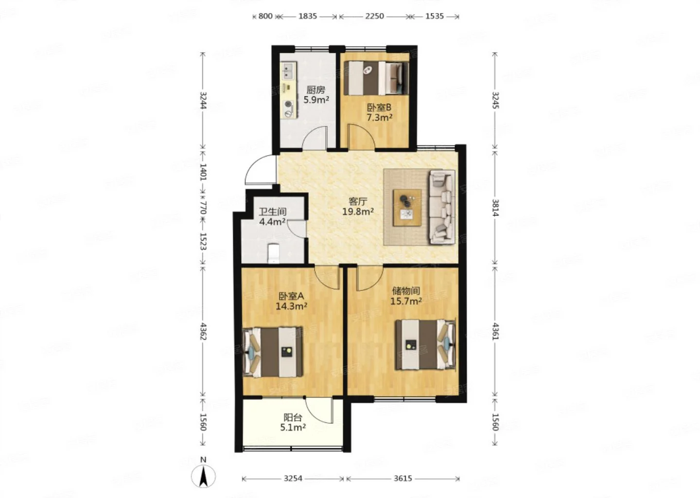
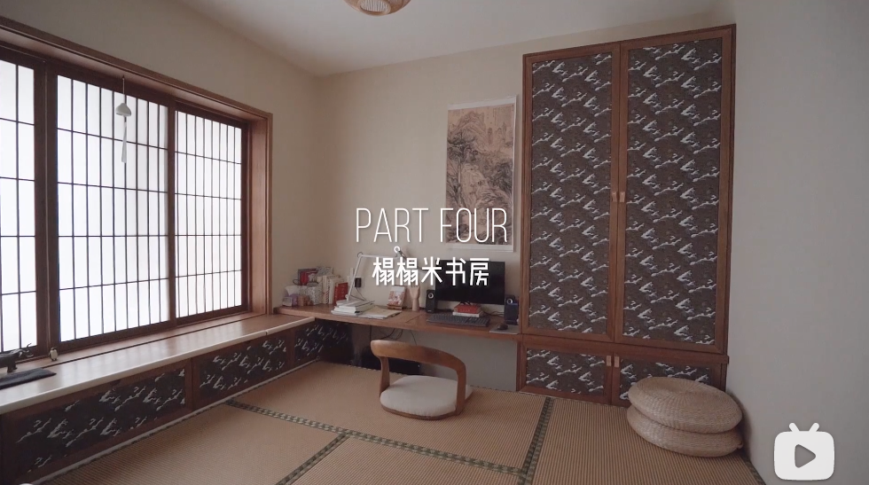
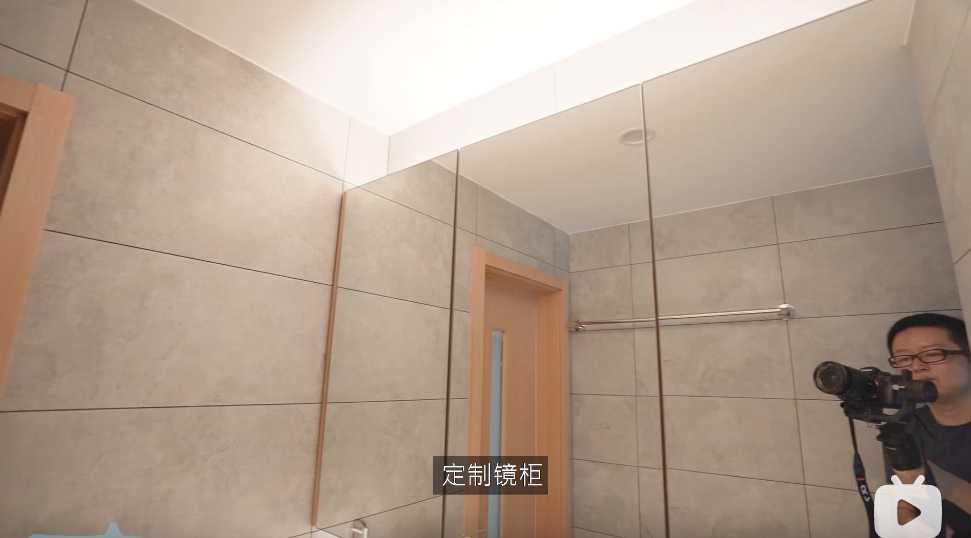
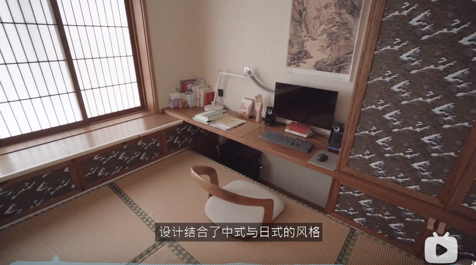
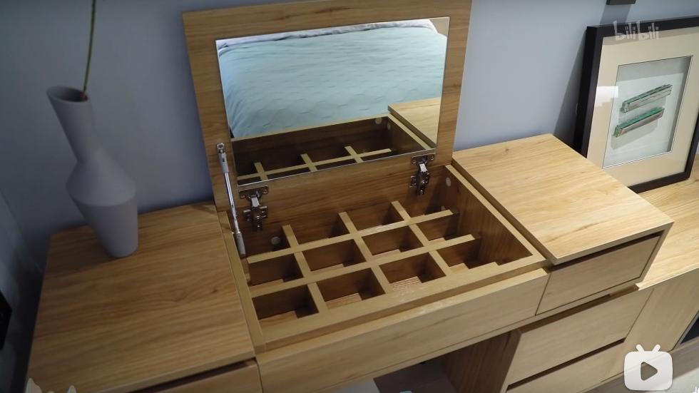

# 临时装修笔记

光线充足的时候可以选用木板，使光线更加柔和
光线不够充足的时候，可以选用墙砖、地砖，使光线更加充足

路由器选用一个主路由器，多个面板路由器

小房间可以用榻榻米的形式。如下图：

小房间与客厅的中间可以用作电视背景墙，或者放餐桌（

主卧要保留婴儿床的位置

客厅预留音响的线路

沙发等家具的实际价值可以砍到标价的三分之一，有些地方的门面费用会比较贵，但如果去源头厂家去买可以直接省去中间商的费用

厨房装西门子嵌入式洗碗机，需考虑后部空间以及插电位置。包括净水器，微波炉烤炉蒸炉（微烤蒸一体机）的位置和摆放，以及冰箱的位置

热水器可以考虑用回水器（视具体情况而定

厨房可以考虑安装冷霸（吸顶式），防止厨房感觉太热了

如果客厅和卧室用了吊顶，可以考虑安装中央空调，或者隐藏式空调

卫生间必须要做好防水工作

马桶旁边预留插座，为以后智能马桶预留，还可以预留一个马桶伴侣的位置

梳洗台可以预留一个带USB的插排，封在里面，可拆卸，只留接口到外面，可以用来给剃须刀等进行充电

厨房和卫生间的下水管可以围一圈吸音棉，然后用水泥和瓷砖进行外包，可以大幅减少楼上用户往楼下冲水的声音
地漏要做弯水管做隔绝臭气

主卧和次卧的床都要1米八宽度的床

洗烘一体机放在阳台，预留一个出水口

客厅和床边都预留几个USB口面板

客厅给扫地机器人预留一个充电位置

玄关位置下方可以留鞋柜，上方除了挂钩还可以留一个穿衣镜

路由器和NAS等服务器可以安装到电视柜里面

卫生间镜柜可以考虑定制，柜子的面板全是镜子，柜子上下方可以暗藏灯带，如下图：

小房间设计的时候可以考虑电脑主机的收纳空间，反面教材如下图，电脑主机和周围风格格格不入：

卫生间厨房必装新风系统，其他房间预留新风系统，卫生间可以考虑吸臭瓷砖

客厅可以采用无主灯设计，全部由间接灯条+射灯

厨房的台面使用岩板，同时水槽也使用岩板水槽（价格昂贵）
优点：耐脏易打理，不怕腐蚀不怕高温，同时颜值高

化妆台设计参考

实木地板要看渗水率如何，渗水率越低越好
实木复合地板，选择产地为浙江湖州的，那里有个叫南浔的地方是实木复合地板的代加工集中窝点
强化复合地板（纸板）不推荐，胶量太大渗水率高

