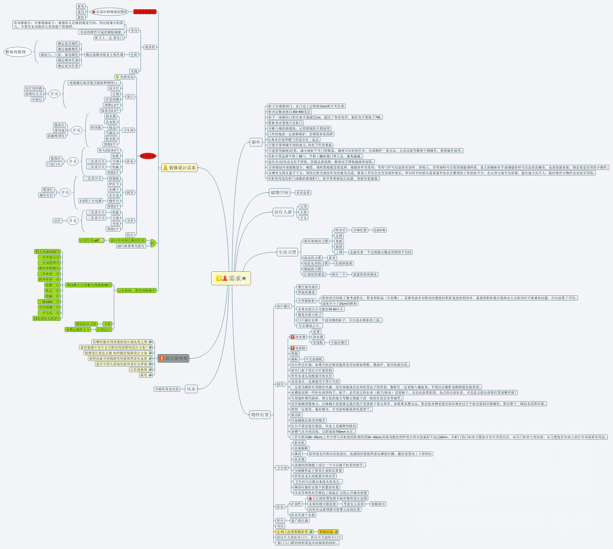

[TOC]

# 装修思维图

# 装修需求

## 装修设计需求

### 未来购物需求
**在设计师规划范围内**
- 家电
- 家具
- 家纺

### 观赏性

#### 布局
布局要留白，不要填满屋子，要留给人足够的视觉空间，用比较矮小的茶几，不要有东西阻挡人看到窗户的视野

#### 色彩
确定装修风格及主体色调
以下所有项目整体风格统一
- 确定家具颜色
- 确定地板颜色
- 确定门、门套、窗套的颜色
- 确定墙体色调
- 确定家具位置

#### 光线

### 插座与网络

插座考虑总体布局

#### 客厅

#### 卫生间

#### 主卧

#### 次卧

#### 厨房

#### 小房间

#### 阳台

### 灯

### 已有材料，需用到装修中

## 设计参考类
有哪些最实用美观的设计或先见之明
家居装修中有什么巧妙实用的照明设计方案？
装修设计要怎么做，如何做好装修设计方案
如何花最少的钱将房间装饰得富有品质
适合中国人的现代厨房是怎么样的

## 物件位置

### 客厅餐厅

### 厨房

### 卫生间

### 卧室

### 阳台

### 小房间

### 玄关

## 生活习惯

## 其他

### 储物空间

### 居住人群

### 生活习惯

### 风水

### 额外
- 柜子从墙

### 设计参考

