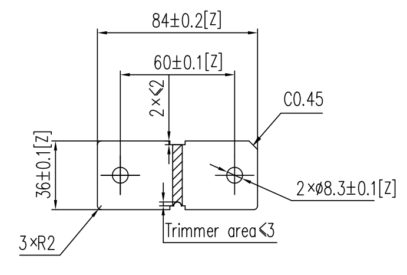
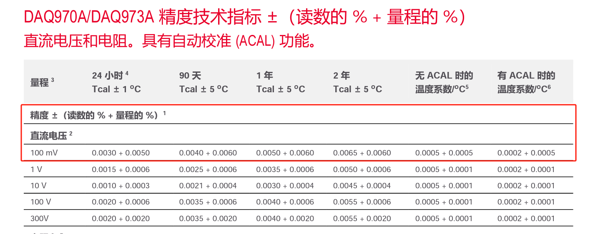

# 分流器介绍与测试要求会议

会议地点：腾讯会议
会议时间：2024年1月16日

## 产品简介

产品为分流器，分流器需求的阻值仅为25微欧，原料阻值会明显大于25微欧，需要不断铣削中间位置并不断测量阻值来达到测量要求。

可以看到产品上下两测居中有方形缺口，产品原料可能会带有此缺口，中间的圆倒角为该项目所需承担的内容。通过铣削圆倒角来实现阻值的控制。可能需要边铣削边测量。

## 测试要求

产品精度要求是千五精度，也就是0.125微欧的精度要求。理论上产品通电流的最大为1000A。

年产量要求是10万，最好能做到单班生产达到产能足够。（CT最好控制在40秒以内）

材料温度的阻值变化目前是-40到125的温度范围内，变化小于150ppm（1ppm=百万分之一）

千分之五精度的话，大概就是0.125mv的精度，至少达到千一甚至万五才能保证测量准确率，良品率由铣刀把控。

DAQ970的万用表，最小量程可以做到0.005mv级别的精度。具体见下表：

