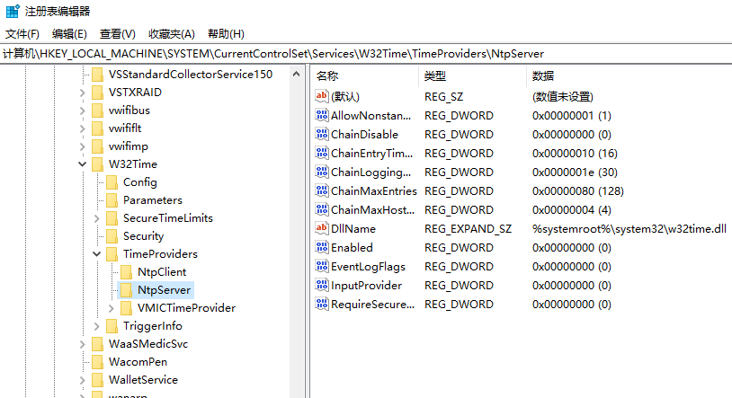
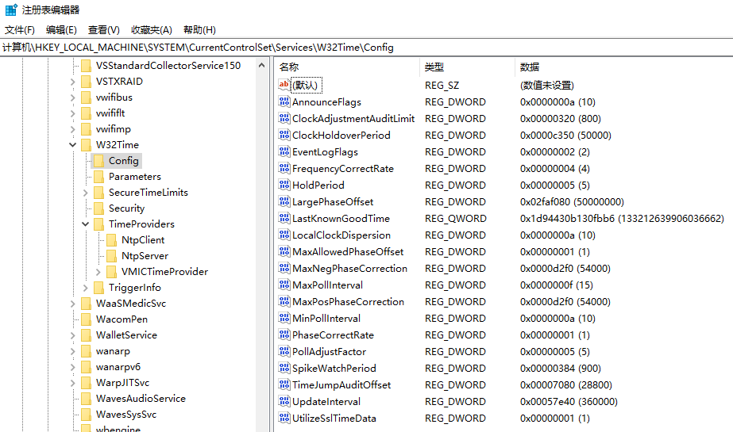
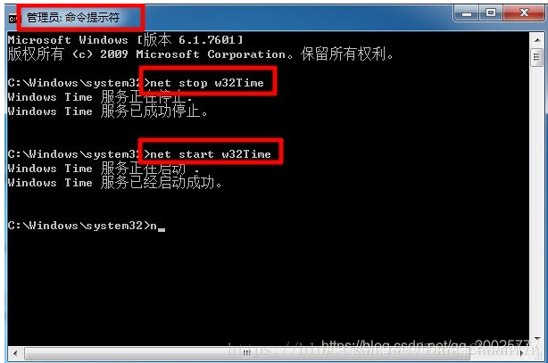
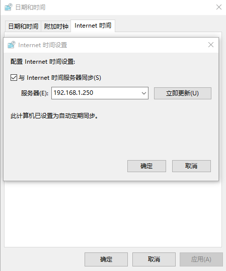

# 关于NTP服务器——时间同步服务器

在一个不联网的局域网中，若要使局域网内的不同主机的时间达到同步，则需要部署NTP服务器。NTP服务器可以安装在Linux系统中，也可以安装在Windows系统中。下面就Windows平台和Linux平台做分别介绍。

## Linux平台

### 服务器

安装ntp
``` bash
sudo apt-get install ntp
```
编辑配置文件：
``` bash
sudo vim /etc/ntp.conf
```
在文件中添加以下内容：
``` bash
restrict 192.168.0.1 mask 255.255.255.0 nomodify notrap
server 127.127.1.0
fudge 127.127.1.0 stratum 10
```
内容表示，在192.168.0.1的网段上的机器能够与本机进行实时同步；第二行和第三行是让本机的硬件时间和本机的ntp服务器进行实时同步。
然后重启ntp服务即可：
``` bash
sudo /etc/init.d/ntp restart
```

### 客户端
在客户端安装ntp：
``` bash
sudo apt-get install ntp
```
编辑配置文件：
``` bash
sudo vim /etc/ntp.conf
```
在文件中添加如下内容：
``` bash
server 192.168.0.100        #配置server端的IP地址
```
然后重启ntp服务即可：
``` bash
sudo /etc/init.d/ntp restart
```
重启ntp服务后，可能会立即生效，也可能需要等待3到5分钟甚至10分钟左右，才会同步好时间。
无需其他配置，下次开机启动时即可自动配置时间，但同样开机后需要一小段时间等待时间同步。

备注：
[主要参考网址](https://blog.csdn.net/scx837685002/article/details/80316280)

[其他参考网址](https://www.cnblogs.com/quchunhui/p/7658853.html)

## Windows平台

### 服务器

首先打开注册表，通过`Win+R`快捷键打开运行界面，输入`regedit`并回车打开注册表。

根据下图链接依次找到NtpServer的地址。
或者复制以下链接：
`计算机\HKEY_LOCAL_MACHINE\SYSTEM\CurrentControlSet\Services\W32Time\TimeProviders\NtpServer`



找到右侧`Enabled`项，双击将其改为`1`。表示启用NTP服务。
然后点开上面的W32Time下的Config。将`AnnounceFlags`从十六进制的`a`改成5。表示设立本机为NTP服务器的授时端。



完成以上操作后，关闭注册表，打开cmd命令行窗口。
分别输入以下两行：

``` bash
net stop w32Time   # 停止NTP服务
net start w32Time  # 启动NTP服务
```



至此，服务端配置完成。


### 客户端

客户端配置更为简单，打开控制面板。打开日期和时间配置，选择Internet时间页面。点击更改设置。将服务器地址更改为局域网内NTP服务器主机地址即可。



点击立即更新，即可立即从服务端更新并同步时间。
点击确定，即可保存此配置。
至此，客户端配置完成。

备注：
[参考网址](https://blog.csdn.net/qq_20025777/article/details/115373055)
