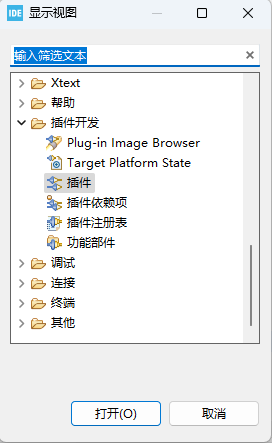
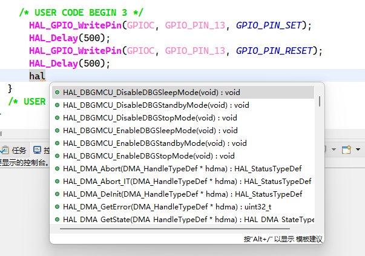

# STM32CubeIDE代码自动提示和补全

正常来讲STM32CubeIDE的代码提示快捷键是`Alt+/`才能触发。无法自动触发。

这里提供一种实现自动代码提示的流程。首先按照以下几张图进行安装相应插件。

主要参考网址：[Cube IDE 实现自动代码补全功能](https://blog.csdn.net/Wu_HuaJie/article/details/129213406)
次要参考网址：[给你的cubeIDE加上翅膀--添加类似keil的代码补全功能！](https://blog.csdn.net/nopear6/article/details/106255311)


安装好后再安装下一个：
地址为：`https://download.eclipse.org/releases/2024-12/`
如下图所示：


安装好后，检查已安装软件中是否包含该项，如果不包含则需要在以上列表中寻找并安装：


然后打开窗口->显示试图->其他


选择插件开发->插件并打开。如果是英文版，则为Plug-in Development->Plug-ins



打开后将会在软件的右下角显示插件窗口。选择org.eclipse.cdt.ui右键选择导入方式->源项目


然后此项目可以在左侧项目管理器中可以看到，如下图：


找到src中下图中的两个文件，后面需要修改这两个文件。


首先打开CContentAssistProcessor.java，跳转到378行的后面添加以下代码：
``` java
default:
    return activationChar >= 97 && activationChar <= 122?true:activationChar >= 65 && activationChar <= 90;
```

未添加前的代码：
``` java
@Override
protected boolean verifyAutoActivation(ITextViewer viewer, int offset) {
	IDocument doc = viewer.getDocument();
	if (doc == null) {
		return false;
	}
	if (offset <= 0) {
		return false;
	}
	try {
		char activationChar = doc.getChar(--offset);
		switch (activationChar) {
		case ':':
			return offset > 0 && doc.getChar(--offset) == ':';
		case '>':
			return offset > 0 && doc.getChar(--offset) == '-';
		case '.':
			// Avoid completion of float literals
			CHeuristicScanner scanner = new CHeuristicScanner(doc);
			int token = scanner.previousToken(--offset, Math.max(0, offset - 200));
			// The scanner reports numbers as identifiers
			if (token == Symbols.TokenIDENT
					&& !Character.isJavaIdentifierStart(doc.getChar(scanner.getPosition() + 1))) {
				// Not a valid identifier
				return false;
			}
			return true;
		}
	} catch (BadLocationException e) {
	}
	return false;
}
```

添加后的代码
``` java
@Override
protected boolean verifyAutoActivation(ITextViewer viewer, int offset) {
	IDocument doc = viewer.getDocument();
	if (doc == null) {
		return false;
	}
	if (offset <= 0) {
		return false;
	}
	try {
		char activationChar = doc.getChar(--offset);
		switch (activationChar) {
		case ':':
			return offset > 0 && doc.getChar(--offset) == ':';
		case '>':
			return offset > 0 && doc.getChar(--offset) == '-';
		case '.':
			// Avoid completion of float literals
			CHeuristicScanner scanner = new CHeuristicScanner(doc);
			int token = scanner.previousToken(--offset, Math.max(0, offset - 200));
			// The scanner reports numbers as identifiers
			if (token == Symbols.TokenIDENT
					&& !Character.isJavaIdentifierStart(doc.getChar(scanner.getPosition() + 1))) {
				// Not a valid identifier
				return false;
			}
			return true;
		default:
			return activationChar >= 97 && activationChar <= 122?true:activationChar >= 65 && activationChar <= 90;
		}
	} catch (BadLocationException e) {
	}
	return false;
}
```

然后保存此文件并打开ContentAssistProcessor.java文件。跳转到348行，可以看到原方法为以下内容：
``` java
public void setCompletionProposalAutoActivationCharacters(char[] activationSet) {
		fCompletionAutoActivationCharacters = activationSet;
	}
```

这里我们将整个方法替换为以下内容：
``` java
public void setCompletionProposalAutoActivationCharacters(char[] activationSet) {
//		fCompletionAutoActivationCharacters = activationSet;
		String index = ".ABCDEFGHIJKLMNOPQRSTUVWXYZabcdefghijklmnopqrstuvwxyz";
       	char[] triggers = index.toCharArray();
       	fCompletionAutoActivationCharacters = triggers;
}
```

保存文件。
然后选择文件->导出


选择导出为Jar文件


使用everything进行搜索：`org.edipse.cdt.ui_`，然后复制出整个文件名：


将导出目标的JAR文件选为同名文件，这里我们先导出到桌面


清单文件中选择现有工作清单


下图警告不需要理会


导出成功后将原先的名字加上bkp后缀，并将新导出的文件复制过去。
这里贴上导出好的文件，有可能后续可以直接调用不需要修改和导出。
[org.eclipse.cdt.ui_8.1.200.202310201538.jar](_v_attachments/274075409277037/org.eclipse.cdt.ui_8.1.200.202310201538.jar)

重新启动STM32CubeIDE后，经过验证已经可以实现自动补全，不需要再按`Alt+/`快捷键。


