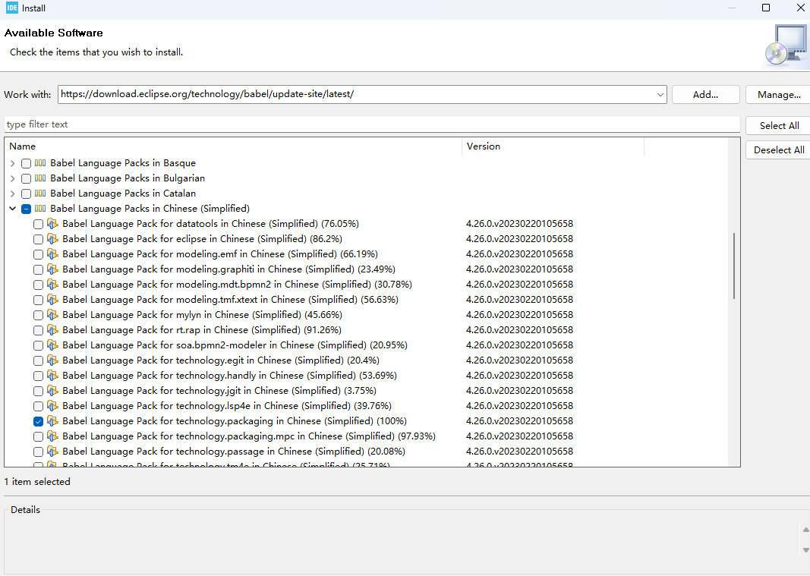
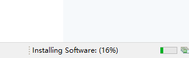

# STM32CubeIDE汉化教程

软件安装好后，点击Help->Install New Software...

Work with里面输入`https://download.eclipse.org/technology/babel/update-site/R0.20.0/2022-12/`并回车。下图仅为参考，请无视下图中的地址。

选择好后，然后一路点击Next，最后同意所有协议最后点击Finish。然后右下角可以看到下载进度。

装好后会自动显示重启提示，一般重启后即可生效。
重启后依然是英文的，请更换别的版本尝试。

如果有装错的可以通过Help->Install New Software...界面下右上角的Manage...打开管理页面进行卸载重装。
