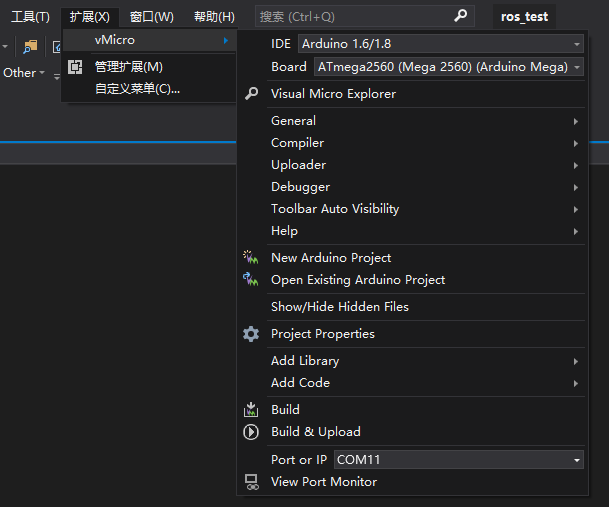

# 通过反编译工具破解vMicro

如果你的系统与vMicro版本和我的一致，不妨将以下文件拿去一试：


## 环境
平台：Windows 10 专业版 1909
VS版本：Visual Studio Community 2019 16.7.6

## 所需软件
1. 反编译工具 `ILSpy.exe`：[ILSpy_v5005124_downyi.com.zip](_v_attachments/20201016104627314_19870/ILSpy_v5005124_downyi.com.zip)
2. 将DLL生成IL文件 `ildasm.exe`：[ildasm.zip](_v_attachments/20201016104627314_19870/ildasm.zip)
    可以从电脑中安装好的Visual Studio中的.NET来直接查找该程序。我查找到的的路径在下方，进入后可直接搜索ildasm，路径仅作参考：
    C:\Program Files (x86)\Microsoft SDKs\Windows\v10.0A\bin\NETFX 4.8 Tools\
3. 将IL文件重新生成DLL `ilasm.exe`
    参考路径：C:\Windows\Microsoft.NET\Framework\v4.0.30319\ilasm.exe
    该程序后续需要在cmd中调用，无需直接打开

## 破解步骤

### 1. 查找ProductActivated
首先得保证vMicro已经安装好，然后在电脑中查找Visual.Micro.Processing.Sketch.dll文件。
我的文件路径参考如下：
C:\Program Files (x86)\Microsoft Visual Studio\2019\Community\Common7\IDE\Extensions\ze3s3dil.pco\Visual.Micro.Processing.Sketch.dll
然后打开ILSpy.exe程序，选择文件->打开，选择路径并打开Visual.Micro.Processing.Sketch.dll


打开后可以看到文件目录下多了Visual.Micro.Processing.SKetch：


点击+号选择里面的程序，路径：Visual.Micro.Processing.Sketch->Visual.Micro.Utils.LicenseShared->ActivatioinManager->ProductActivated(string):bool
点击ProductActivated函数，即可在右侧看到函数内容：

可以看到当productIndex的值为-1的时候，就会返回false，我们这里直接把整个函数改成return false;
但在此之前，我们需要将文件转为IL后，才可以修改内容。

### 2. 转化为IL
打开ildasm.exe，选择文件->打开，打开Visual.Micro.Processing.Sketch.dll


打开后，再次点击左上角：文件->转储。无需修改，直接点确定，选择路径，保存为IL代码。注意：转储后并不只有一个IL文件，还有其他的文件，建议专门新建一个文件夹来存放。

### 3. 修改IL文件
找到刚刚保存的IL文件，右击选择文本框或者用Notepad++来打开，我这里推荐使用Notepad++打开。
按Ctrl+f来搜索ProductActivated函数。

搜索完成后，删除掉`{}`之间的代码，然后填入上图中的内容，这里我把代码贴在下方：
``` IL
// Code size 7 (0x7)
.maxstack 1
.locals init ( [0] bool CS$1$0000)
IL_0000: nop
IL_0001: ldc.i4.1
IL_0004: ret
```
修改完成后，Ctrl+s保存，然后Ctrl+w关闭文件。
文件修改好之后，接下来就可以生成dll文件了。

### 4. 生成dll文件
生成dll文件需要ilasm.exe的程序，我的路径是在C:\Windows\Microsoft.NET\Framework\v4.0.30319\ilasm.exe下，这里我直接Win+R打开运行，输入cmd启动cmd.exe。
这里，我直接通过cd进入我之前保存IL格式文件的文件夹中。然后执行：
```
C:\Windows\Microsoft.NET\Framework\v4.0.30319\ilasm.exe /dll/resource=Visual.Micro.Processing.Sketch.res Visual.Micro.Processing.Sketch.il
```
注意，最前面为ilasm.exe的程序路径，后面为/dll/resource=，然后为Visual.Micro.Processing.Sketch.res文件和空格以及Visual.Micro.Processing.Sketch.il文件，因为我就是在当前文件夹下，直接输入文件名即可，否则需要在每个文件的前面加上路径。


回车后，即可开始生成.dll文件，稍等片刻，可以看到生成成功：


在IL文件的路径下，即可找到新生成的dll后缀的文件，表示dll文件已经生成成功。

### 5. 替换并验证
将dll文件复制到原路径下，前提需要将Visual Studio与ILSpy.exe关闭，解除原文件的占用，然后才可以复制。
如果需要管理员权限的也提供管理员权限并继续，替换原有文件后。即可完成整个破解过程。
可以再次打开ILSpy.exe验证，可以看到这个函数将会直接返回true：


也可以打开Visual Studio，可以看到，没有禁用，也没有buy了：


也祝各位一次性破解成功！

--End--

[参考网址](https://blog.csdn.net/sbkd1/article/details/88053104)
