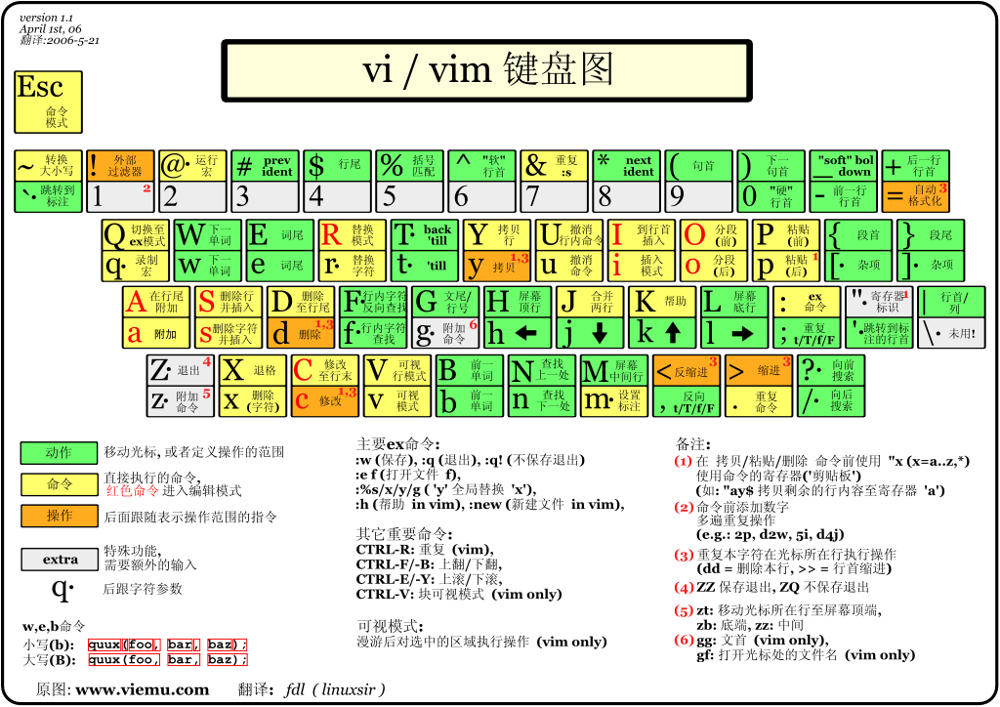

[]

# Vim按键说明

vim键盘图

## 一般模式

### 移动光标
|      移动光标的方法      |                    |
| ---------------------- | ------------------ |
| `h`或 向左箭头按键 (`←`) | 光标向左移动一个字符 |
| `j`或 向左箭头按键 (`↓`) | 光标向下移动一个字符 |
| `k`或 向左箭头按键 (`↑`) | 光标向上移动一个字符 |
| `l`或 向左箭头按键 (`→`) | 光标向右移动一个字符 |
如果你将手放在键盘上的话，你会发现hjkl是排列在一起的，因此可以使用这四个按钮来移动光标。如果想要进行多次移动的话，例如向下移动30行，可以使用`30j`或者`30↓`的组合按键，亦即加上想要进行的次数（数字）后，按下动作即可！
| 移动光标的方法 |     |
| --- | --- |
| [Ctrl] + f | 屏幕**向下**移动一页，相当于`[Page Down]`按键（常用） |
| [Ctrl] + b | 屏幕**向上**移动一页，相当于`[Page Up]`按键（常用） |
| [Ctrl] + d | 屏幕**向下**移动半页 |
| [Ctrl] + u | 屏幕**向上**移动半页 |
|       +      |  光标移动到非空格符的下一行 |
|       -       | 光标移动到非空格符的上一行 |
| n[Space] | 那个n表示**数字**，例如20。按下数字后再按空格键，光标会向右移动这一行的n个字符。例如20[Space]则光标会向后面移动20个字符距离 |
| `0` 或功能键`[Home]` | 0是数字零，并非字母O，表示移动到这一行的最前面字符处（常用） |
| `$`或功能键`[End]` | 移动到这一行的最后面字符处（常用） |
| H | 光标移动到这个屏幕的最上方那一行的第一个字符 |
| M | 光标移动到屏幕的中央那一行的第一个字符 |
| L | 光标移动到这个屏幕的最下方那一行的第一个字符 |
| G | 移动到这个档案的最后一行（常用） |
| nG | n表示数字，移动到这个档案的第n行。例如20G则会移动到这个档案的第20行（可配合`:set nu`） |
| gg | 移动到这个档案的第一行，相当于`1G`（常用） |
| n[Enter] | n为数字，光标向下移动n行（常用） |

### 搜索替换
| 搜索替换                                        |                                                                                                                                                                                                        |
| :--------------------------------------------- | :----------------------------------------------------------------------------------------------------------------------------------------------------------------------------------------------------- |
| /word                                          | 在光标之下寻找一个名称为word的字符串。例如要在档案内搜寻vbird这个字符串，就输入`/vbird`即可！（常用）                                                                                                           |
| ?word                                          | 在光标之上寻找一个名称为word的字符串。                                                                                                                                                                    |
| n                                              | 这个n是英文按键。代表重复上一个动作。举例来说，如果刚刚我们执行了`/vbird`去向下搜寻vbird这个字符串，那么按下n后，会继续搜寻下一个名称为vbird的字符串。如果是执行`?vbird`的话，那么按下n则会向上继续搜寻名称为vbird的字符串 |
| N                                              | 这个N是英文按键。与`n`刚好相反，为反向进行前一个搜寻动作。例如`/vbird`后，按下N则表示向上搜寻vbird。                                                                                                            |
| :n1,n2s/word1/word2/g                          | n1与n2为数字。在第n1与n2行之间寻找world1这个字符串，并将该字符串取代为word2，举例来说，在100到200行之间搜寻vbird并取代为VBIRD则：`:100,200s/vbird/VBIRD/g`                                                       |
| `:1,$s/word1/word2/g` 或 `:%s/word1/word2/g`   | 从第一行到最后一行寻找word1字符串，并将该字符串取代为word2（常用）                                                                                                                                           |
| `:1,$s/word1/word2/gc` 或 `:%s/word1/word2/gc` | 从第一行到最后一行寻找word1字符串，并将该字符串取代为word2！且在取代前显示提示字符给用户确认(confirm)是否需要取代（常用）                                                                                         |

### 删除、复制与粘贴
| 删除、复制与粘贴 |                                                                                                                                                                                               |
| :------------- | :------------------------------------------------------------------------------------------------------------------------------------------------------------------------------------------- |
| `x`,`X`        | 在一行字中，x为向后删除一个字符（相当于[Del]按键），X为向前删除一个字符（相当于[Backspace]退格按键）                                                                                                   |
| nx             | n为数字，连续向后删除n个字符。举例来说，我要连续删除10个字符:`10x`                                                                                                                                  |
| dd             | 删除游标所在的那一整行                                                                                                                                                                          |
| ndd            | n为数字，删除光标所在的向下n行，例如20dd则是删除20行                                                                                                                                               |
| d1G            | 删除光标所在到第一行的所有数据                                                                                                                                                                   |
| dG             | 删除光标所在到最后一行的所有数据                                                                                                                                                                 |
| d$             | 删除游标所在处，到该行的最后一个字符                                                                                                                                                              |
| d0             | 0为数字的0，删除游标所在处，到该行的最前面的字符                                                                                                                                                   |
| yy             | 复制游标所在的那一行                                                                                                                                                                            |
| nyy            | n为数字，复制光标所在的向下n行，例如20yy则是复制20行                                                                                                                                               |
| y1G            | 复制游标所在行到**第一行**的所有数据                                                                                                                                                             |
| yG             | 复制游标所在行到**最后一行**的所有数据                                                                                                                                                           |
| y0             | 复制光标所在的按个字符到该行**行首**的所有数据                                                                                                                                                    |
| y$             | 复制光标所在的那个字符到该行**行尾**的所有数据                                                                                                                                                    |
| `p`,`P`        | p为将已复制的数据在光标下一行贴上，P则为贴在光标上一行！举例来说，我目前光标在第20行，且已经复制了10行数据，则按下p后，那10行数据会贴在原版的20行之后，亦即由21行开始贴。但如果是按下P，那么原本的第20行会变成30行 |
| J              | 将光标所在行与下一行的数据结合成同一行                                                                                                                                                            |
| c              | 重复删除多个数据,例如向下删除10行：`10c`                                                                                                                                                         |
| u              | 复原前一个动作                                                                                                                                                                                 |
| [Ctrl] + r     | 重做上一个动作                                                                                                                                                                                 |
| .              | 不要怀疑，这个就是小数点，意思是重复前一个动作的意思。如果你想要重复删除。重复贴上等等动作，按下小数点`.`就好了                                                                                          |

有一点需要注意的是：**Vim的复制和剪贴的内容和系统剪贴板并不兼容**，比如你从系统复制到剪贴板的内容，在vim中并不能直接通过p来粘贴，包括y复制的内容也并不能直接粘贴到Vim之外的地方。如果想要和系统剪贴板进行交互，具体的操作方式如下：
从Vim复制到剪贴板：首先通过`[shift]+v`的方式来选中多行，比如说`10 [shift]+v`，然后通过`"+y`，即可复制到剪贴板。注意前面还有一个双引号！此操作并不表示同时按键，加号也是需要输入的！
从剪贴板复制到Vim：通过`"+p`即可复制剪贴板中的内容到Vim。
通过上面可以看出，`"+`即代表了系统剪贴板。

## 一般模式与编辑模式的切换
| 进入输入或取代的编辑模式 |                                                                                                   |
| :-------------------- | :------------------------------------------------------------------------------------------------ |
| `i`, `I`              | 进入输入模式(Insert mode)：i为从目前光标所在处输入，I为在目前所在行的第一个非空格符处开始输入             |
| `a`,`A`               | 进入输入模式(Insert mode)：a为从目前光标所在的下一个字符出开始输入，A为从光标所在行的最后一个字符处开始输入 |
| `o`, `O`              | 进入输入模式(Insert mode)：这是英文字符o的大小写。o为在目前光标所在的下一行处输入新的一行                 |
| `r`,`R`               | 进入取代模式(Replace mode)：r只会取代光标所在的哪一个字符一次；R会一直取代光标所在的文字，直到按下ESC为止； |
| [Esc]                 | 退出编辑模式，回到一般模式中                                                                         |
上面这些按键中，除了最后一个，其余操作后都会在vi画面的左下角处会出现`--INSERT--`或`--REPLACE--`字样。特别注意的是，当你想要在档案中输入字符时，一定要在左下角看到这两个字样才能开始输入！

## 指令行模式
| 指令行的储存\离开等命令 |                                                                                                     |
| :-------------------- | :------------------------------------------------------------------------------------------------- |
| :w                    | 将编辑的数据写入硬盘档案中(保存)                                                                       |
| :w!                   | 将编辑的数据强制写入到硬盘档案                                                                         |
| :q                    | 退出vim                                                                                             |
| :q!                   | 强制退出                                                                                            |
| :wq                   | 保存后退出，若为`:wq!`则为强制保存后退出                                                               |
| ZZ                   | 保存后退出，效果等同于`:wq`                                                                           |
| ZQ                    | 不保存，强制退出，效果等同于`:q!`                                                                      |
| :w [filename]         | 将编辑的数据储存成另一个档案(另存为)                                                                   |
| :r [firename]         | 在编辑数据中，读入另一个档案的数据，亦即将[firename]这个档案的内容加到游标所在行的后面                      |
| :n1,n2 w [filename]   | 将n1到n2的内容存储成[filename]这个档案                                                                |
| :! command            | 暂时离开vi到指令行模式下执行command的显示结果！例如`:! ls /home`即可在vi当中查看/home底下以ls输出的档案信息 |
| :set nu               | 显示行号，设定之后，会在每一行的前缀显示该行的行号                                                       |
| :set nonu             | 与set nu 相反，为取消行号                                                                             |
特别注意，在vi/vim中，数字是很有意义的！数字通常代表重复做几次的意思，也有可能是代表去到第几个什么什么的意思。
举例来说，要删除50行，则是用`50dd`。数字加在动作之前，如我要向下移动20行，就是`20j`或者是`20↓`即可。

## 其他快捷键

### 折叠

| 命令  | 功能                                            |
| ----- | :--------------------------------------------- |
| zc    | 折叠代码块                                      |
| zo    | 展开代码块                                      |
| zC    | 对所在范围内所有嵌套的折叠点进行折叠               |
| ZO    | 对所在范围内所有嵌套的折叠点展开                   |
| za    | 当光标在关闭折叠上时，打开之。在打开折叠上时，关闭之 |
| zA    | 与`za`类似，但对当前折叠与嵌套的折叠都有效         |
| zR    | 打开所有折叠                                     |
| zM    | 关闭所有折叠                                     |
| zf10G | 折叠到第10行                                    |
| \[z   | 到当前打开的折叠的开始处                          |
| ]z    | 到当前打开的折叠的末尾处                          |
| zj    | 向下移动，到达下一个折叠的开始处。关闭的折叠也被计入 |
| zk    | 向上移动到前一折叠的结束出。关闭的折叠也被计入      |
| zE    | 删除所有的折叠标签                               |
[折叠指令参考网址](https://blog.csdn.net/weixin_34099526/article/details/94679672)

