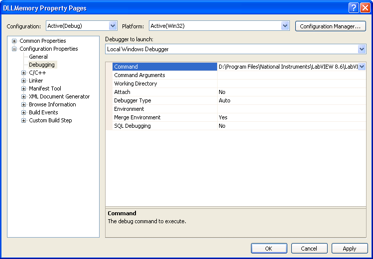

# DLL 调试

在一个大型项目中，有可能部分代码使用 C 语言编写，而另外一部分代码使用 LabVIEW 语言编写。这种混合编程方式是非常常见的。

## 调试 LabVIEW 调用的 DLL

在项目中，最常用的混合编程方式是使用 LabVIEW 编写程序界面，用 VC 编写某些算法和数据采集部分。C 语言部分的代码被编译成 DLL 文件，在 LabVIEW 中通过 CLN 节点调用这些 DLL 文件中的函数。有些用 C 语言编写的函数中可能存在某些错误，只有当它们在 LabVIEW 程序中被调用时才会显现出来。这就要求在 LabVIEW 程序运行时，调试这些 DLL 函数。

调试 C 语言的代码还是要在 VC 的编程环境中调试。对于生成可执行文件的 C 程序，在代码中设置断点再运行，程序即可暂停在断点处，然后进行单步调试等。对于生成的 DLL 也可以使用类似方法进行调试。

由于 DLL 是不能直接运行的，所以要让 VC 调用 LabVIEW，才能进行调试。设置的方法是在 VC 项目的属性中，设置 "Debugging-\>Command" 为 LabVIEW.exe 可执行文件（图
8.41）。

图 .41 设置 VC 中的调试命令

设置好调试命令，再在 VC 中点击 "开始调试" 按钮或菜单，VC 就会把 LabVIEW 调用起来。如果代码中有断点，程序会暂停在断点处。

使用这种调试方法时，需要注意：被调试的 DLL 应当处于调试模式下。并且，在开发调试过程中，计算机内可能存有多份不同版本的这一 DLL 文件。要确保 LabVIEW 调用的 DLL 确实是当前正在调试的版本。

## 调试 LabVIEW 生成的 DLL

另一种 LabVIEW 与 C 语言混合编程的模式是使用 C 语言编写高层部分，如界面等。使用 LabVIEW 完成底层部分，如数据采集、分析。这一使用方法与上节所提到的恰好相反，需要调试的代码部分也正好相反。在这种模式下可能会遇到的调试需求是，当 C 语言程序调用 LabVIEW 生成的 DLL 时，DLL 中的函数出现了错误，需要调试 LabVIEW 代码才能找出错误根源。

这类调试比较容易进行。只要在 LabVIEW 生成 DLL 的时候在 VI 中设置断点，程序运行至断点处就会暂停下来，并且打开断点所在的 VI。接下来可以使用一般调试 VI 的方法进行调试即可。