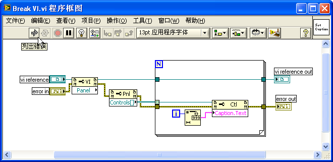
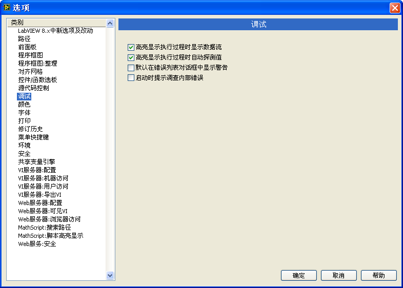

# 集成调试环境

## 列出编译错误

VI 程序框图窗口上的工具栏中，有多个用于调试程序的按钮，可以帮助编程者找出程序错误所在。

对于某些程序中的错误，如缺少必要的输入、数据类型连接错误等，LabVIEW 可以在编辑 VI 的同时就发现它们。LabVIEW 发现这些错误后，会把 "运行" 按钮变成断裂箭头模样的 "列出错误" 按钮（图
8.1）。用户只要点击这一按钮，在弹出的 "错误列表" 窗口中就会显示出程序中的错误（图
8.2）。

图 .1 一个有错误的 VI

图 .2 错误列表

错误列表窗口会列出有错误的 VI 和 VI 中具体存在问题的节点。除了显示导致程序不能运行的错误之外，它还可以提供一些警告信息，显示程序可能存在问题的地方。

双击列表中列出的条目，即可弹出出错的 VI，并高亮显示出 VI 中相应的出错位置。

## 运行时的调试工具

有些错误，是不可能在编辑过程中被 LabVIEW 自动发现的。比如，程序中的逻辑错误等，只有在程序运行过程中，产生了错误或没有返回预期结果时，用户才能意识到程序存在错误。修改这样的错误，首先要对错误进行定位，找到程序中产生错误的具体位置，然后才好对症修改。

最常用的错误定位方法是：让程序在有可能出错的位置前暂停，然后单步执行。每执行一个函数或节点，都观察一下这个函数或节点的输出与预期的正确结果是否相符。若在执行某一步时，开始出现错误，则此处很可能就是症结所在。

VI 程序框图窗口工具栏中的 "暂停"、"单步步入" 等按钮，是用于帮助程序进行调试的。

图 .3 正在运行的一个 VI 的程序框图

图
8.3 是一个正在运行的 VI 的程序框图。如果有其它编程语言的调试经验，看到工具栏上的按钮的图形，基本上就可以知道它的功能了：

 用于停止整个程序的执行。调试到中途，不想让程序继续执行下去了，可以使用这个按钮。

 用于暂停或者继续程序的执行。使用这个按钮可以让运行的程序暂停，或让暂停的程序继续执行到终结、或直到下一个断点处再停下来。

 用于启动高亮显示执行。在高亮显示执行时，LabVIEW 会放慢代码的执行速度，并且在程序执行到每一个节点时，高亮显示这个正在被执行的节点。高亮显示执行的速度非常慢，所以启用它要非常小心。如果启动高亮显示执行的同时，某个 VI 前面板的设置是 "模态"（modal）的（在 VI 属性框的 "窗口外观" 页，按 "自定义..." 键，进入 "自定义窗口外观" 页，勾选 "模态" 选项），那么再想中途关掉它是不可能的了。只能非常痛苦地等待程序的结束，或杀掉整个 LabVIEW 进程。所谓前面板或者一个窗口是 "模态" 的，是指这个前面板被打开后，总是置于同一程序的其它所有窗口之上。用户只能对 "模态" 前面板进行操作，而不能点击或编辑任何其它窗口。只有在 "模态" 前面板关闭后，才能继续点击其它窗口上的控件。一般来说，程序中的对话框就是 "模态" 的。

启用高亮显示时，程序框图的数据线上会显示一个小点在流动，以演示数据在数据线上的流动。这样，可以更形象地观察程序的执行流程。

 用于保留 VI 程序框图上数据线中的数据。如果这个按钮被按下，在程序执行过某根数据线之后，在数据线上流过的数据就会被保存下来。用户可以继续使用探针来查看这些数据。

 用于单步执行。它们三个分别表示进入、跳过或跳出某个节点、结构以及子 VI。

 下拉框表示 VI 的调用关系。如果正在被调试的是一个程序中的子 VI，在这里可以显示出子 VI 的调用关系。打开下拉框，可以看到当前 VI 从低层到高层的逐级被调用关系。选择下拉菜单中的某一项，即可跳到被选中的那个 VI 处。

除了上述这些工具，在进行调试时，通常还需要使用到断点和探针。断点和探针都是设置在程序框图上的。如果是在数据线上设置断点，数据线上会显示出一个红色的圆点：。如果断点设置在某一节点上，这个节点会被一个红色的框包围起来。探针只能加载数据线上，它会在数据线上添加一个标签：。标签中的数字表明这是哪一个探针。而探针所在处的数据会在如图
8.3 所示的悬浮窗口中显示出来。

## 全局选项

在 LabVIEW 的选项对话框上（点击 "工具 -\> 选项..." 菜单），有四个与调试相关的选项（图
8.4）。

图 .4 与调试相关的选项

a) "高亮显示执行过程时显示数据流" 表示在高亮显示执行的过程中显示数据的流动。
b) "高亮显示执行过程时自动探测值" 表示在高亮显示执行的过程中，数据从每个接线端流出时，显示数据的数值。
c) "默认在错误列表对话框中显示警告" 表示在默认情况下，在错误列表的对话框中显示警告信息。
d) "启动时提示调查内部错误" 表示在 LabVIEW 启动时检查是否存在内部错误。 

## VI 的属性

某些 VI 的属性设置（譬如某个 VI 被设置为不允许调试），会导致这个 VI 无法调试。禁止 VI 调试可以大大提高 VI 的运行速度，降低 VI 的内存占用。所以，在 VI 发布给用户时，最好把它设为不可调试。对于从别人那里得到的 VI，如果发现它不可以调试，应该首先查看一下它是否被设置为不可调试了。如果是，可以重新设置其为允许调试，然后再进行调试（图
8.5）。

图 .5 允许调试的 VI 属性设置

在有些情况下，VI 是无论如何都无法被调试的。比如，VI 被设置了密码保护，而你又不知道密码；或者 VI 在保存时被移除了程序框图。在这两种情况下，VI 就无法调试了。