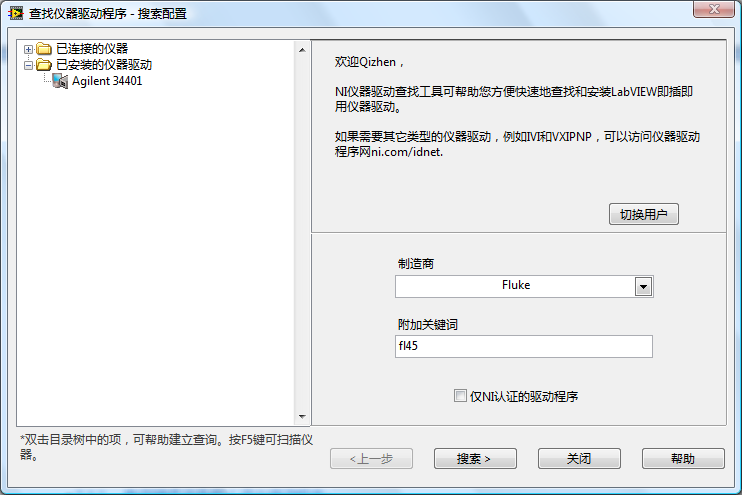
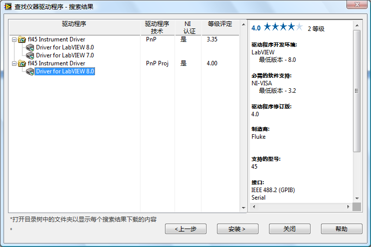
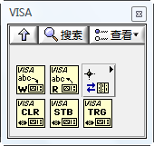
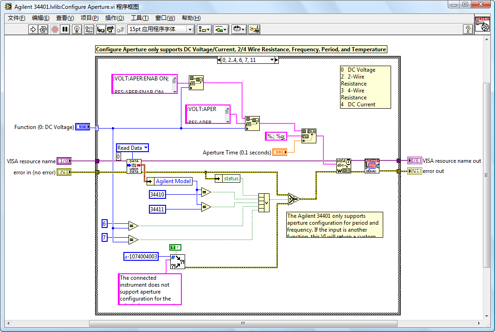
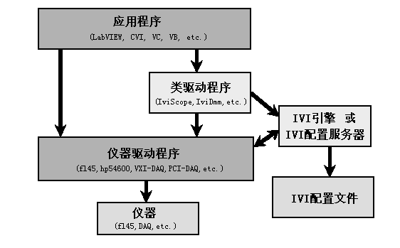
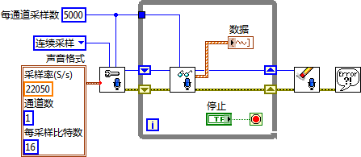

# 数据采集

数据采集通常是测试程序第一步需要做的工作。它负责从硬件设备得到表示物理量或信号的数据。

## 使用驱动程序

不论使用何种数据采集设备，如果该设备已经具备了专为 LabVIEW 设计的驱动程序，那么使用驱动程序会大大简化编程的复杂度。用于采集数据的硬件设备多种多样，包括了各种板卡式设备、传统仪器、嵌入式智能设备等。它们的驱动程序也各不相同。但是，它们的功能和使用方法大体是类似的：通过调用驱动程序提供的接口 VI 按顺序分别打开或初始化设备；对设备进行必要的配置；从设备中读出数据；最后关闭设备。

NI 公司出产的硬件设备一般都配有 LabVIEW 驱动程序，其它公司出产的硬件设备很多也带有 LabVIEW 驱动程序，用户可以联系该硬件厂商以得到相应的驱动程序。

对于比较常见的仪器设备，可以使用 LabVIEW 提供的 "查找仪器驱动程序" 工具来查找并安装其驱动程序。该工具位于 LabVIEW 的菜单项："工具 -\> 仪器 -\> 查找仪器驱动"。

图
7.12 是 "查找仪器驱动程序" 工具的启动界面。使用这个工具前首先要申请一个 ni.com 的登录帐号并登录，人后才可以按照厂商名和关键词来搜索仪器的驱动程序。图
7.13 是找到的结果。

图 .12 使用 "查找仪器驱动程序" 工具查找仪器驱动程序

图 .13 "查找仪器驱动程序" 工具的查找结果

## 使用硬件设备的 C 语言驱动程序

还有部分硬件设备可能没有提供 LabVIEW 驱动程序，但这些硬件设备一般会提供 C 语言驱动程序。C 语言的驱动程序一般以 DLL 的形式提供，DLL 中包含了控制硬件设备或读取数据所需的函数。同时驱动程序也会提供一个.h 头文件，用于声明驱动程序中函数的定义。

在 LabVIEW 中使用这种类型的驱动程序时，可以在应用程序中直接使用 CLN 节点来调用这些驱动程序函数。但是使用 CLN 节点并不直观。更好的方式是先把 C 语言驱动程序包装成 LabVIEW 驱动程序的形式，再在 LabVIEW 中使用。

简单的包装方式可以使用 LabVIEW 中的 "导入共享库" 工具，把 DLL 中的函数全部导入 LabVIEW，包装成 VI。在测试程序中使用以 VI 形式提供的驱动程序功能要比直接使用 CLN 方便得多。因为 VI 中可以包含更多的信息，比如关于函数功能的说明，参数的数值范围、功能等。

如果某个驱动程序使用的频率较高，就值得花些时间，把它设计得更为专业和易用。如果重新设计驱动程序结构，就可以不局限于把每个 DLL 函数包装成一个 VI，而是可以按照在 LabVIEW 下使用该仪器最自然的方式设计驱动程序中每个 VI 的功能。一个 VI 中也许会调用多个 DLL 函数。这样的 VI，功能可能会更强大一些。编写这类驱动程序时，可以参考在 LabVIEW 中使用的 IVI 仪器驱动程序，它们也是通过包装 DLL 的方式实现的。

## 编写驱动程序

某些不太常用或功能简单的数据采集设备可能没有提供任何形式的驱动程序，而是在程序中向仪器发送以字符串或数值表示的命令来控制这些仪器设备。

仪器设备通常使用 GPIB、USB、网线等数据线与电脑相连。在 LabVIEW 中向这些设备发送数据，可以使用 "仪器 I/O-\>VISA" 函数（图
7.14）。其中最常用的是 VISA 写入和 VISA 读取函数。

图 .14 VISA 函数

为 VISA 函数的 "VISA 资源名称" 参数指定正确格式的地址，就可以把一个数据发送到一台通过某种数据线与电脑相连的设备上。在 LabVIEW 帮助中有对这个资源名称格式的详细说明。

在应用程序中直接使用 VISA 函数与直接使用 CLN 节点一样，有其不足之处：不直观、配置繁琐。所以，对于没有驱动程序的硬件设备，可以自己为它编写驱动程序，然后再在应用程序中使用。所谓驱动程序，实际上也就是一组 VI，每个 VI 包含了硬件设备最常用的功能。仪器的常用功能一般由一个或数个命令构成。比如，需要从仪器中读取一个测量值，就必须先发送命令告诉仪器进行测量，然后发命令告诉仪器发送数据，再读出数据。与此相对应，一个驱动程序的 VI 也是由一个或多个 VISA 函数构成。图
7.15 是 LabVIEW 自带的 Agilent
34401 万用表的驱动程序中的一个 VI。在它的程序框图中，实现功能的主要部分就是通过 VISA 函数向仪器发送命令的。

图 .15 驱动程序 VI 的程序框图

编写驱动程序，首先要设计驱动程序的结构。结构中要包括驱动程序应当包含哪些 VI，每个 VI 的功能是什么，每个 VI 如何实现等。设计驱动程序应当参考已有的驱动程序或规范。毕竟，设计一个驱动程序的接口和结构也是需要花费一定时间的，如果直接采用已经设计好的接口，就省时省力多了。将来使用这一驱动程序的用户，也会因为它和其它驱动程序十分类似而缩短学习使用它的时间。

## 可互换虚拟仪器驱动程序

可互换虚拟仪器（Interchangeable Virtual
Instrument，缩写 IVI）驱动程序规范是由 IVI 基金会（Interchangeable Virtual
Instrument
Foundation）制定的一种仪器驱动程序规范。它最大的特点就是实现了仪器在程序运行时的可互换性。

如果在测试程序中使用普通的驱动程序，那么势必造成测试软件对硬件设备和驱动程序的依赖。如果把测试程序移至一台没有该驱动程序的电脑上，测试程序是无法运行的。如果另一台电脑上连接的仪器设备与第一台电脑连接的仪器不同，那么只能重新编写测试程序，使用新的仪器驱动程序。IVI 仪器驱动程序与普通仪器驱动程序的不同之处就在于，测试程序不需要重写或重新编译，就可以更换仪器设备，利用其它型号的仪器完成测试功能。

为了实现互换性，IVI 基金会将同类别仪器的共性提取出，并制定了每个类别的规范。比如，有示波器类的规范、数字万用表类的规范、频谱分析仪类的规范等等。每一类的仪器都有各自的 "类驱动程序"（IVI
Class
Driver）。类驱动程序包含了该类仪器通用的各种属性和操作函数。运行时，类驱动程序通过调用每台仪器的专用驱动程序（IVI
Specific
Driver）中相应的函数来控制仪器。比如，IviDmm 是数字万用表类的类驱动程序，而 fl45 则是针对 Fluke
45 这个型号万用表的专用驱动程序。

电脑上可能安装有同一个类型的多种型号仪器的专用驱动程序。类驱动程序应当调用哪一个专用驱动程序，可以在 IVI 配置文件中指定。安装 LabVIEW 时，还会同时安装一个叫做 "Measurement
&
Automation"（简称 MAX）的软件。这是 NI 公司专用于配置计算机硬件设备的应用软件，通过它可以比较直观地修改 IVI 配置文件中的设置。

图 .16 IVI 体系结构

为了实现仪器互换，在编写测试程序的时候，程序中调用的是类驱动程序。类驱动程序检查 IVI 配置文件，以确定应该使用的专用驱动程序。若系统中的仪器被更换，只需适当修改 IVI 配置文件，而应用程序无需任何改动，因而实现了测试系统的通用性（图
7.16）。

IVI 驱动程序相对于传统仪器驱动程序而言，更适用于高端应用和大型测试系统的搭建。比如，笔者曾经编写过一套校准程序，这套程序要满足多家不同的校准实验室使用。每个实验室所拥有的仪器都不尽相同，而为每个实验室编写一套单独的程序又效率太低。此时，使用 IVI 体系结构编写校准程序就是最好的选择。校准软件只需编写一份，而每个实验室只要在 MAX 中配置自己所拥有的仪器就可以使用这套校准软件了。

## 数据采样时钟的设置

使用数据采集设备时，对于采样频率的设定是极其重要的。比如，程序要求每秒钟从数据采集设备中读取 100 个数据出来，即采样间隔时间为 10 毫秒。编程者可能很自然地想到，可以使用 LabVIEW 中的延时函数。在程序中放置一个循环，循环内加一个 10 毫秒的延时，每循环一次读一个数据即可。

但是，这样的程序有几个问题：一是在运行非实时操作系统如 Windows 的计算机上，延时函数可以支持的最低值也只有 1 毫秒，采样间隔低于 1 毫秒就无法使用这种方法了。二是使用延时的方法精度较低。比如把延时设置为 1 毫秒时，其误差极大，可能高达 1 毫秒的几十倍。而一般数据采集对于采样间隔时间的精度要求都是比较高的。再有，每采集一个数据就从读一次数据采集设备，在如此高的数据量下，是一种效率非常低下的做法。

实际上，一般的数据采集设备都是自带时钟的。它的时钟精度都比较高。所以，不应当使用软件的定时方法来设定程序的采样间隔，而是应当使用数据采集硬件设备上的时钟。硬件设备提供的驱动程序包含有采样间隔时间（有的设备称之为 "采样频率"）的设置，只需为它设置一个合适的值即可。而从硬件设备读取数据时，可以每次读一批数据以提高程序效率。

还是以前面的采集声音为例。如果程序需要持续采集音频信号并同时显示出来，就不适合使用 Express
VI 了。声音采集 Express
VI 只适合单次采集一定长度的音频信号。要完成这一连续采集，可以使用 "编程 -\> 声音 -\> 输入" 中的 VI。这些 VI 就相当于声卡的驱动程序 VI。

图
7.17 是一个简单的音频信号采集程序。程序中，首先使用 "配置声音输入"VI 设置采样频率为 22050，声卡硬件会根据这一数据配置自己的时钟。该程序设定了采样数为 5000。这样，声卡硬件每读取完 5000 个数据后，就会一次性把这些数据读入内存。程序再把这些数据显示出来。每一次显示 5000 个数据的效率，比分 5000 次，每次显示一个数据的效率要高得多。

图 .17 持续采集声音信号