# Express VI

## 什么是 Express VI

Express VI 是指那些带有配置对话框，可以在编辑 VI 时就设置输入参数值的 VI。Express VI 是专为简化常见类型的程序而设计的。一些 LabVIEW 常见的程序模式，比如完成数据采集、波形的频域变换等功能的程序，都可以使用一两个 Express VI，做一些简单配置，就可以完成。为了便于程序员寻找，LabVIEW 中的常用的 Express VI 都可以在函数选板 "Express" 中找到；也有一些功能复杂，不太常用的 Express VI 被按照功能归类到了其它子函数选板中。

从函数选板上直接就可以看出 Express VI 与普通 VI 的区别：Express VI 的图标周围有一圈浅蓝色的边框。如下图中的 "时间延迟" 和 "已用时间"VI。

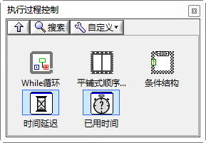 

Express VI 在使用时，也与普通 VI 有些不同。Express VI 通常都配有一个配置对话框（下图），用于设定 Express VI 运行时所需的一些数据，因而不必再在程序框图上输入数据。这就大大简化了程序框图。Express VI 的功能通常都比一般的 VI 强大。某些常见的简单程序，譬如基本的数据采集显示程序，仅需使用几个 Express VI 就可以实现。加之使用它编程也比较简单，所以得名 "Express VI（中文直译快捷 VI）"。

  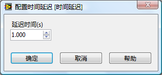 

Express VI 的功能强大、使用便捷，但付出的代价是效率较低。在一些功能简单的应用程序中，它所调用的 Express VI 也许包含了大量应用程序根本用不到的功能。这部分功能既占用内存空间，又会影响程序的运行速度。所以，对于效率要求较高的程序，不适合使用 Express VI。

## 子 VI 在程序框图上的显示方式

普通子 VI 被放置到程序框图上时，其默认的显示方式是图标。在以图标方式显示时，可以在其右键菜单中选择 "显示项 -> 接线端"，将其连线板显示出来。它还有另一种显示方式：可扩展节点。在子 VI 的右键菜单中放弃选择 "显示为图标" 便可以更改其显示方式。以可扩展节点方式显示的子 VI，可以通过拖拽框图的下边框线把所有的接线端都移至下方列出（下图右侧的子 VI）。

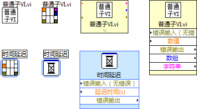

Express VI 与普通子 VI 一样，也有这几种显示方式。不过，Express VI 的默认显示方式是可扩展节点，而且不论在哪种方式下，它都带有一个蓝色背景的边框。

以可扩展节点方式显示的子 VI 要占用较大的显示面积，但它也有很多优点：它可以把子 VI 接线端的名称显示出来，增强了程序的可读性；Express VI 的可扩展方式是可伸缩的，暂时用不着的接线端可以被缩起来。被拉伸开来的接线端之间的距离比较宽松，如果 VI 上的接线端较多，使用可扩展方式显示的子 VI 更利于区分各数据线和接线端。

比如下图中的 "ex\_subFileWrite.vi" 子 VI，其输入输出参数非常之多，使用可扩展节点方式可以清楚地显示出每个参数的连线情况。如果使用图标方式，则根本无法分清参数是如何连接的。

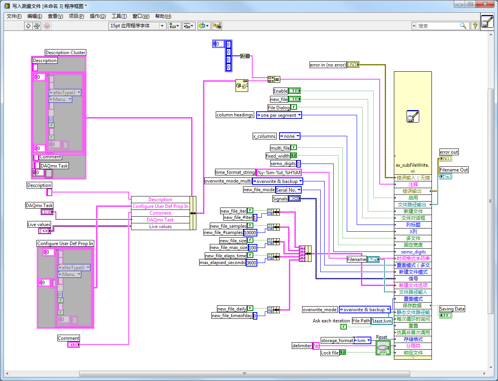

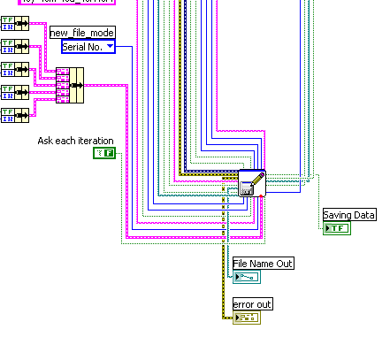

## Express VI 工作原理

普通的子 VI 有前面板和程序框图。子 VI 前面板上的控件定义了这个子 VI 所使用的参数；程序框图上的代码实现了这个子 VI 的功能。在某个 VI 程序框图上，双击一个普通子 VI 的图标，可以打开这个子 VI 的前面板；按住 Ctrl 键双击子 VI 的图标则可以同时打开它的前面板与程序框图。

Express VI 的行为与普通子 VI 有所不同：在程序框图上双击一个 Express VI 的图标，弹出的是一个配置对话框。一般来说，应用软件中的普通子 VI 都是由程序员自己开发的，因此，需要打开子 VI 的前面板与程序框图进行编辑、修改和调试。而 Express VI 通常是 LabVIEW 或 LabVIEW 工具包自带的，并不需要普通程序员去创建或修改一个 Express VI，一般也就不需要看到它内部的代码。一个 Express VI 通常会集成多种功能，因此程序员在使用它时，可以方便地打开 Express VI 的配置对话框，根据各自的需要，选择适合的配置参数。

普通的子 VI 的程序框图被保存在一个.vi 文件中，对于普通子 VI 来说，不论是哪个应用程序调用它，或在应用程序的哪个地方调用了它，该子 VI 所执行的代码都是相同的，也就是说都是运行保存在.vi 文件中的那个程序框图。对于 Express VI 来说，却并非如此。程序员可以根据需要修改 Express VI 配置对话框中的内容，配置一旦被改变，Express VI 的执行代码也会发生变化。因此，在不同的地方调用同一个 Express VI，它所运行的代码却可能是不同的。这也就决定了 Express VI 的程序框图不能被保存在单一的一个.vi 文件中。实际上，Express VI 的程序框图是被保存在调用它的 VI 的.vi 文件中的。比如说，某个 VI 名为 A.vi。若 A 调用了一个名为 B 的 Express VI，则 B 的程序框图也被保存在了 A.vi 中。不过，用双击 B 图标的办法是无法直接看到 B 的程序框图的。

有些 Express VI 是允许用户查看其程序框图的（有些则不提供这一功能）。在一个 Express VI 的右键菜单中选择 "打开前面板"，LabVIEW 会把 Express VI 转换成不可配置的普通子 VI，它的代码也就被固定下来了。这样，它就有了可以打开的前面板和程序框图。以 "从动态数据转换"Express VI 为例（函数选板 "Express --> 信号操作 --> 从动态数据转换"）。在某一 VI 的程序框图上放置两个 "从动态数据转换"Express VI，分别命名为 "数据转换 1" 和 "数据转换 2"。

把 "数据转换 1"Express VI 的 "结果数据类型" 配置为 "一维波形数组"：

再把 Express VI 转换为普通 VI 并查看其程序框图：

 

可以看到这个 Express VI 的程序框图由一个简单的子 VI 构成：

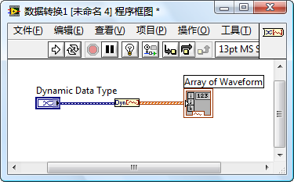 

把 "数据转换 2"Express VI 的 "结果数据类型" 配置为 "二维标量数据"；标量数据类型配置为 "布尔"。使用同样方法打开 "数据转换 2"Express VI 的程序框图。可以看到，它与 "数据转换 1" 的程序框图完全不同，因为它们需要完成的功能是完全不同的。

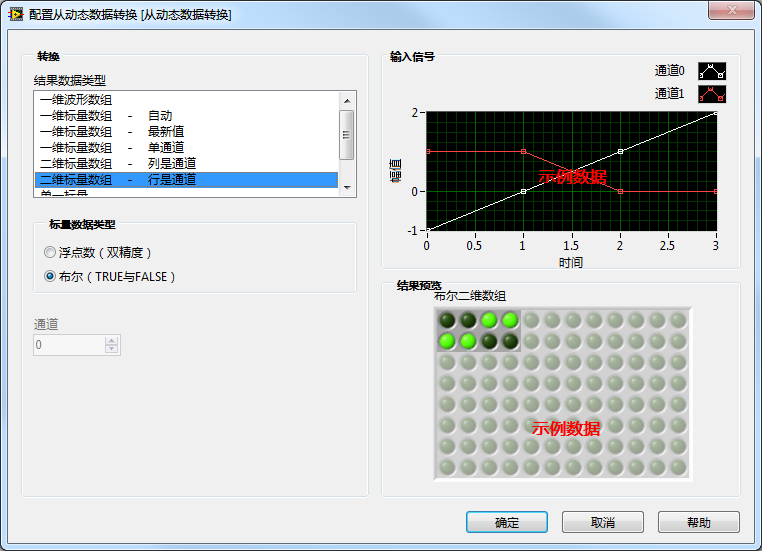 

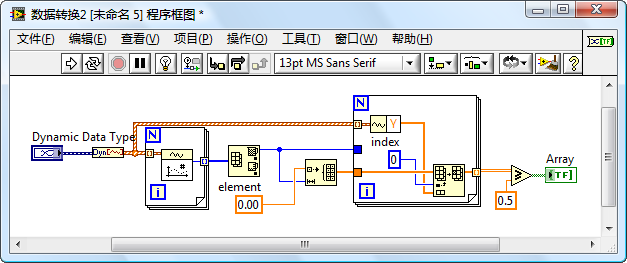 

## Express VI 的优缺点

相当一部分使用 LabVIEW 的用户并非计算机软件或相关专业的人士，他们或许并不擅长编写复杂的程序。为此，LabVIEW 想尽办法，降低编程难度，以满足非计算机专业人士的需求。 降低编程难度的手段之一，就是使用简单的参数配置来代替复杂的程序逻辑。比如完成某一功能，如果仅仅是在某一面板上选择几个参数，肯定要比在程序框图上编写代码容易得多。

为了简化编程，LabVIEW 把测试领域常常会用到的一些功能集成到了几个功能极为强大的子 VI 中。子 VI 的功能越复杂，所需的各类数据就越多。比如，测试程序常常会遇到需要产生一个波形数据的情况，为此，LabVIEW 提供了一个产生波形数据的 Express VI。

产生一个波形数据需要编程者提供诸如波形的类型、频率、幅值、相位、采样率、采样数等数十个具体的参数。如果用一个普通子 VI 的方式来提供这些功能，这个子 VI 就需要有数十个接线端，以至于它的程序框图显得杂乱无章，降低了程序的可读性。更何况编程者也很难在程序还未运行之前就设计好每个数据的具体值。这样就使得编程更为困难复杂。

而实际上，在某些特定的应用场合，并不需要把这十几个参数都作为变量来考虑。对于某个特定的程序而言，它往往只需要产生某种固定的波形，或只需要某些固定的频率、幅值等。也就是说，程序只需要其中一部分功能。在这种情况下，使用功能复杂的大 VI，不但给人一种杀鸡用牛刀的感觉，而且由于参数过多，使用起来并不简便。

Express VI 正是为了解决这一矛盾而出现的。它为使用者提供了一个配置对话框，VI 所需的数据可以在配置界面上直接选择。第一次把 Express VI 放置在程序框图上或者双击程序框图上的 Express VI，就会显示出它的配置界面。配置界面上有提示信息，可以帮助编程者选择正确的配置数据。有的配置界面还带有反馈信息。比如，仿真信号 Express VI 的配置界面上就包含了 "结果预览"。编程者无需运行程序，在配置参数的同时，就可以在此界面观察到所选参数的效果了。

Express VI 大大简化了编程的难度，但也带有它固有的缺陷。到目前为止，Express VI 的数量有限，不可能覆盖所有测试程序所需的功能。若程序要求比较特殊，或者使用的是不太常见的仪器、数据采集卡等设备，仍然需要用普通的子 VI 来编写程序。

Express VI 的另一缺点是其效率较一般 VI 低。一般而言，Express VI 功能复杂，而应用程序通常只会用到其中的一部分，它的其它众多功能在这个应用程序中是毫无用处的。而由于 Express VI 提供了众多附加功能，通常它的代码比一般 VI 更臃肿，运行速度也慢一些。

## 开发自己的 Express VI

除了 LabVIEW 自带的 Express VI，如果编程者愿意，也可以创建自己的 Express VI。在 LabVIEW8.6 以后的版本中，打开 "工具 -> 高级 -> 创建或编辑 Express VI" 菜单项，将弹出一个 "创建或编辑 Express VI" 的对话框，并可按部就班制作出一个 Express VI。

## 测试程序相关的 Express VI

由于测试程序是 LabVIEW 程序最常见的类型，LabVIEW 特别提供了很多针对这类程序的 VI。这其中包括了针对数据采集 / 发生、分析、显示、保存等各方面的 Express VI:

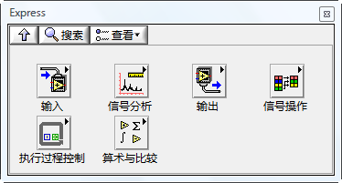

为了简化程序员的工作，LabVIEW 把测试领域常用的功能都集成到了为数不多的几个功能极为强大的子 VI 中。子 VI 的功能越复杂，所需的各类数据就会越多。而实际上，针对某一特定的程序而言，一般只需要配置复杂子 VI 的几个简单参数即可。

比如，程序中常会需要产生一个波形数据。因此，LabVIEW 需要提供给编程者一个产生波形数据的子 VI。产生一个波形需要编程者提供很多信息，比如波形的类型、频率、幅值、相位、采样率、采样数等数十个数据。如果以一个普通子 VI 的方式来提供这些功能，会使得程序框图显得杂乱无章，降低了程序的可读性。更严重的是，编程者也很难在程序还未运行之前就设计好每个数据具体的值。这样就增加了编程的复杂度。

Express VI 正是为了解决这一矛盾而出现的。它为使用者提供了一个配置对话框，VI 所需的数据可以在配置界面上直接选择。第一次把 Express VI 放置在程序框图上或者双击程序框图上的 Express VI，就会出现它的配置界面。配置界面上有提示信息，可以帮助编程者选择正确的配置数据。并且有的配置界面带有反馈信息，比如，仿真信号 Express VI 的配置界面上就包含了 "结果预览"。编程者无需运行程序，就可以及时地在此界面观察到所选参数的效果了。

下图是 "仿真信号"Express VI 的配置对话框，改变频率、幅值等参数，立刻就可以在 "结果预览" 中看到仿真信号波形的变化。

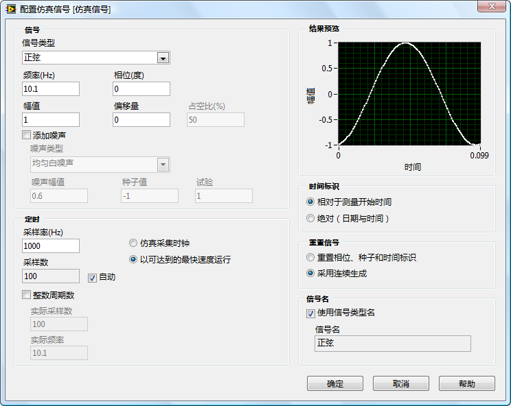

## 应用

如果使用的是 NI 公司的数据采集设备，再配合 Express
VI，那么编写一般的测试程序是非常简单的。基本上，采集、处理、显示、存储等几个主要步骤，每个步骤只要使用一两个 Express VI 就可以了。

比如安装了 "DAQmx" 软件包之后，在采集数据时，可以使用它提供的 "DAQ Assistant"Express VI（图 7.8）：

这个 Express VI 的配置对话框是一个向导型的界面，它可以一步一步地指导编程者选择并配置采集信号所使用的 NI 硬件：

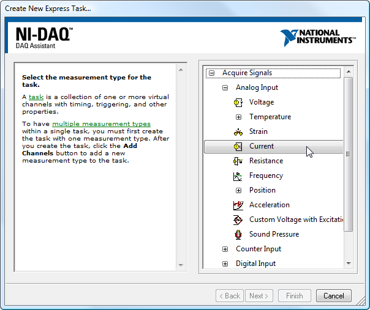

用户首先选择一个需要测量的信号量，然后向导会列出可以使用的硬件。选择硬件后，再对其做相应的配置。

并不是每台电脑上都装有同型号的 NI 公司的数据采集卡，不过，大多数电脑都配有声卡。声卡也是一种信号输入输出设备，所以本书主要以声卡为例演示数据采集程序。使用声卡同样可以便捷地利用 Express VI 完成编程。下面要实现这样一个程序：产生一个正弦波，通过计算机的扬声器把这个正弦波以声音形式发出；再使用麦克风，把声音信号采集进来；然后，比较原始波形和重新采集进的波形的功率谱的差别。

这个程序有四个主要步骤：产生波形信号、输出信号、采集信号、计算信号功率谱。这四个步骤分别使用四个 Express VI 就可以完成。其程序框图如下图所示：

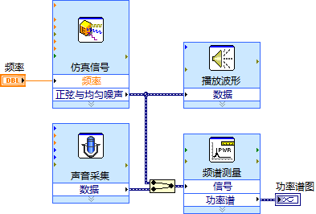

下图显示了程序的运行结果。在其功率谱图上，蓝色（亮色）的是原始信号，红色（暗色）的是通过麦克风采集进来的信号。可以看出，再次从麦克风采集进来的信号与原始信号相比，频率相同，但功率有所下降，相对噪音增加。

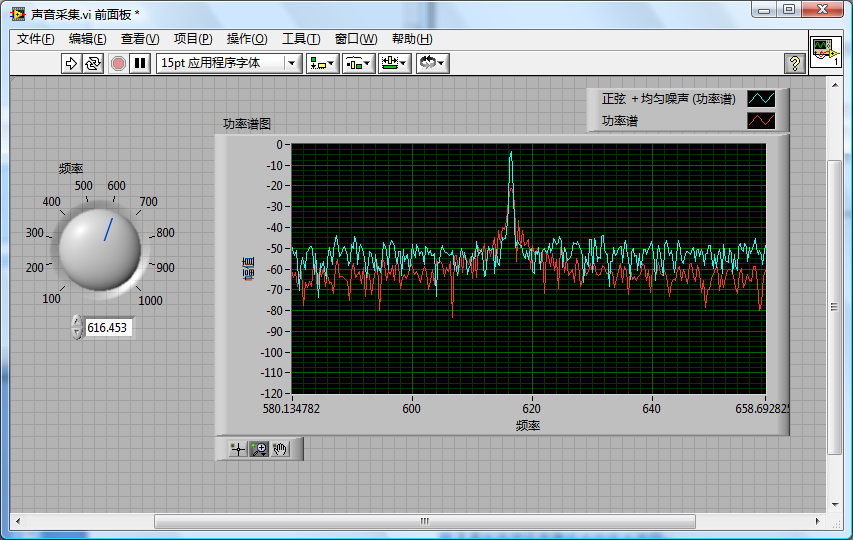

在配置这几个 Express VI 的时候需要注意，仿真信号的长度应当与声音采集的长度相同，以避免采集数据中混入更多无用信号。

Express VI 编程虽然简单，但其功能毕竟有所局限，它只包含了测试程序中最常用的那些功能。若程序要求比较特殊，或者使用的是其它公司的仪器、数据采集卡等设备，那么还是需要用那些功能比较单一的底层 VI 来编写程序的。