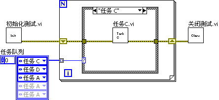
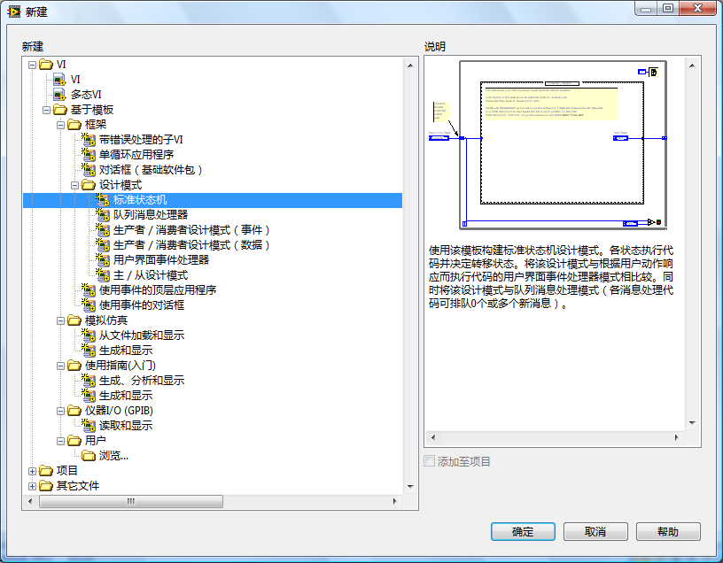

# 状态机

## 循环条件结构

循环条件结构是指在循环结构内嵌套了一个条件结构这样的一种复合结构。它是 LabVIEW 中常见的程序结构模式之一。

假设需要编写这样一个测试程序，它有多项测试任务：任务 A、任务 B......，需要顺序执行每一个测试任务。这是一个典型的顺序结构的程序，可以采用上一章提到的顺序结构程序的编写方法。它的代码如图
4.17 所示

图 .17 顺序执行测试任务

如果程序要求更复杂一些，简单的顺序结构就不够灵活了。比如，有多种产品需要测试，但每种产品的测试流程不一样，有的产品需要测试任务 ABC，有的需要测试任务 CDB，等。虽然，可以针对不同产品编写不同的测试程序，但那要就太麻烦了。

一个更为有效的方法是把测试任务作为测试程序的输入，程序根据用户每次指定的测试任务顺序来调用测试任务。这个程序可以使用循环条件结构来完成，如图
4.18 所示。

图 .18 按照输入的顺序执行测试任务

这个程序中的 "任务队列" 应该是一个输入控件，用户不需要改动程序，只需在主界面选择一组测试任务，就可以改变它的输入值。这里为了便于演示，把它变成了一个常量。"任务队列" 是一个数组，元素按照任务执行的顺序排列。在程序运行时，循环每迭代一次，循环结构就从 "任务队列" 中取出一个任务，然后由条件结构根据该任务的名称选择并进入相应的分支，执行该任务。

## 单状态传递的状态机

假设测试程序的逻辑更复杂一些，如要求根据某一测试任务的运行结果再决定选择下一个测试任务。这样就要求循环迭代一次后，才产生下一次迭代条件结构的选择条件。我们可以把程序再改进如图
4.19：

图 .19 状态机模式的测试程序

程序开始时，首先指定一个初始任务。条件结构处理完初始任务后，根据当前结果设定下一个任务。由于不能预期循环需要迭代几次，所以需要使用 while 循环。并且，条件结构还多了一个 "结束测试" 分支，这个分支用于退出 while 循环，它负责把 "真" 值传递给循环停止条件接线端。

改进后的这个程序结构模式也被称为状态机。状态机中具有一定个数的状态，它在某一时刻仅处于一个状态，在收到某事件或数据后跳转到另一状态。在程序中，每个条件结构中的分支表示一个状态，循环下一次迭代，就跳转到另一个状态中去了。

状态机是一个比较常用的结构模式，所以 LabVIEW 的新建 VI 模板中提供了状态机 VI 的模板。需要使用这一模板时，在 LabVIEW 的启动界面，或打开 VI 的 "文件 -\> 新建" 菜单，在弹出的新建对话框中，选择 "VI-\> 基于模板 -\> 框架 -\> 设计模式" 中的 "标准状态机"（图
4.20）。状态机是一种特殊的循环条件结构。

图 .20 新建 VI 模板中的状态机模板

## 多状态传递的状态机

在图
4.19 所示的程序中，每一个状态结束前，它只能指定下一个状态。但在实际程序中，有时执行完一个分支的代码，就可以根据当前数据，确定后两次迭代中需要执行的分支。完成这种功能需要用到队列。

队列是一种数据结构，队列中可存放多个类型相同的数据。队列中的数据必须是先进先出，即每次从队列中取出一个数据时，只能取队列中最先被放进去的那个。LabVIEW 有关队列操作的函数在函数选板 "编程 -\> 同步 -\> 队列操作" 中。在第 4.8.3 节中，还将详细介绍队列的相关内容。

使用队列对状态机进行改进后程序如下：

图 .21 使用队列的状态机

图
4.21 中的程序首先创建一个队列，用于保存程序中需要跳转到达的状态，并在进入循环前，把初始状态加入队列。循环每次迭代，首先从队列中取出下一状态，用于选择条件结构的分支。在一个分支处理完毕后，再把后续要跳转到的多个状态加入队列。

## 状态机的使用

很多程序的运行过程都可以用状态机来表示。在设计 LabVIEW 程序时，可以先画出程序的状态机，即状态图，然后根据状态图按照图
4.19 或图
4.21 的状态机模式编写出程序。这是一种相当有效的程序设计开发过程。因而，状态机一度成为非常流行的 LabVIEW 程序模式。所以在 LabVIEW 的模板中，才有状态机的框架程序。

但是状态机也有它的不足之处。

首先，状态机的核心是一个条件结构。条件结构、事件结构和层叠式顺序结构都有一个共同的缺点：每次只能显示一个分支中的代码，不利于程序阅读。所以，如果可以避免的话，就没必要非得使用这几种结构不可。

其次，状态机不适合应用于大型程序。程序规模加大之后，如果再用状态机来表示它，必然造成状态数量的急剧膨胀，表示它的状态图会变得非常混乱。而 LabVIEW 条件结构中的分支过多，会大大降低程序的可读性和可维护性。

再者，LabVIEW 事件结构的功能越来越完善，在很多应用场合早已取代了这种基于循环条件结构的状态机。比如对用户界面的处理，在 LabVIEW 的早期版本中，状态机曾是一种最为有效的程序模式，而在 LabVIEW 引入事件结构后，这种由循环条件结构组成的状态机使用得越来越少了。目前常见的一些程序结构模式，例如在第 4.5 节将要介绍的循环事件结构模式，也可以看作是一种状态机。但是，事件结构已代替了条件结构，因为使用事件来控制程序状态的跳转更加便捷。

## 状态图工具包

对于已经设计出状态图的程序，LabVIEW 有一种更简便直观的方式实现它，这就是 LabVIEW 状态图工具。它是一个需要单独安装的 LabVIEW 工具。

比如，某程序用于控制红黄绿三盏灯光，其界面由三盏灯光和 "Change
Color"、"Pause"、"Play"和"Stop" 四个按钮组成。程序的状态图如图 4.22 所示。

图 .22 灯光控制状态图

用基于循环条件结构的状态机来实现本程序，最终的程序框图与状态图在外观上大相径庭。需要一番仔细查看，才能把条件结构中的分支以及跳转条件与状态图中相应的元素对应起来。

而使用状态图工具，则可以把程序框图编写得与状态图完全一致。图
4.23 所示就是这个灯光控制程序的程序框图。

图 .23 状态图程序框图

尽管这个状态图与普通的 VI 程序框图完全不同，但它也是可以直接在 LabVIEW 中运行的。