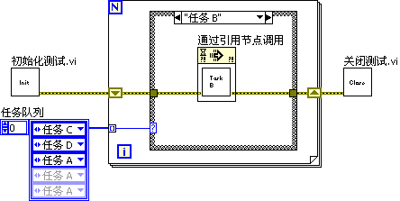
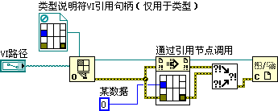
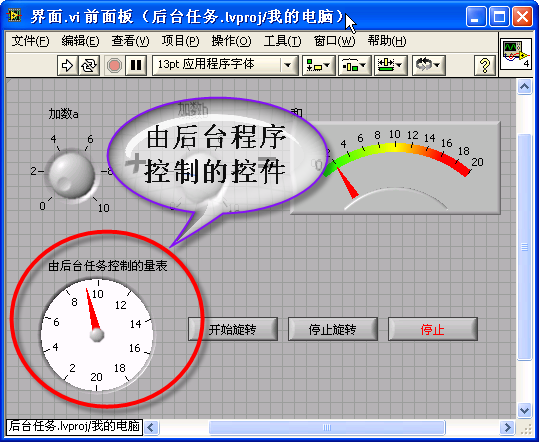
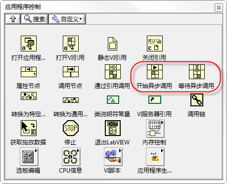
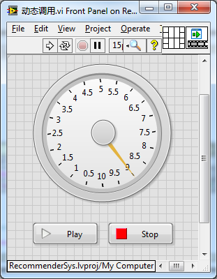
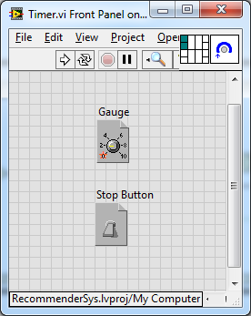
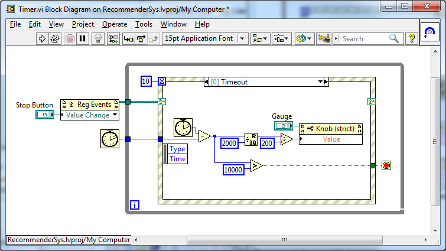
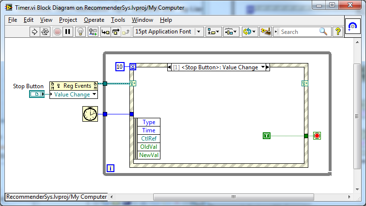
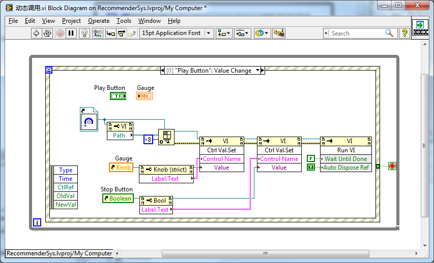
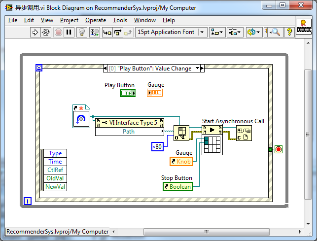

# 装载和运行子 VI

## 静态与动态装载子 VI

一般情况下，一个 VI 被打开时，它所有的子 VI 也都会同时被装入内存。这种把子 VI 载入内存的方式称为静态装载。对于一些小型程序而言，这种做法没有任何不妥。但是对于大型的、有成百上千个子 VI 组成的程序来说，在主 VI 打开的同时，装入所有的子 VI，这种做法将带来两个主要的弊病。一是占用内存过大，二是程序启动速度过慢。

在大型程序中，总会有一些运行分支上的子 VI 使用频率较低。按照使用的频率可以把子 VI 分成三个级别：经常被使用的（比如，启动主程序十次，某个子 VI 至少有三四次会被运行到）；偶尔被使用的（比如，启动主程序一百次，某个子 VI 只有不到十次会被运行到）；几乎从来不被使用的（比如，启动主程序上百次，某个子 VI 才会有一次被运行到）。那些偶尔被使用的以及几乎从来不被使用的 VI，如果也随同主 VI 一起在启动时被装入内存，很可能程序在一段较长的运行期间内都不会被程序用到。但它们却与经常被用到的子 VI 一样，占用了宝贵的内存和程序启动时间。

解决这个问题的思路其实很简单 ------ 就是在程序启动时，暂时不载入这些子 VI，直到需要运行到它们的时候再将其装入内存。这样一来，在程序未用到它们时，就不会为它们分配内存。同时，程序启动时不用装载那么多子 VI，启动速度也可以提高。实际上，装载这些子 VI 所占用的时间被分散到程序运行中去了。

另外，对于几乎从来不被使用的子 VI，在运行结束后，可以立即把它卸载出内存以节约内存。但是比较常用的 VI 应该一直存放在内存中，因为把 VI 卸载再装入内存是比较耗时的。

在子 VI 的右键菜单中选择 "调用设置..."，即可在 "VI 调用配置" 对话框中指定何时把此子 VI 加载入内存。其缺省值是设置为 "与调用方同时加载"。比如，对于图 4.18 中的程序，"任务 B" 这个子 VI 偶尔被调用，就可以把它设置为 "首次调用时加载并保留"（图 6.17）。于是，程序在第一次运行 "任务 B.vi" 时才会把它装载进内存。如果设置为 "每次调用时重新加载"，那么这个子 VI 每次运行结束后，都会被卸载出内存（图 6.18）。

图 .17 子 VI 的调用设置对话框

图 .18 设置子 VI 为首次调用时加载并保留

子 VI 被设置为 "首次调用时加载并保留" 或 "每次调用时重新加载" 之后，实际上是由 "通过引用节点调用" 这个节点来调用的。所以它们的图标外观看上去有了一些改变，不再是普通子 VI 的模样，而是类似于一个 "通过引用节点调用" 节点（该节点位于 "编程 -> 应用程序控制" 函数子选板）。这两种设置的图标略有差别：设置为 "首次调用时加载并保留" 时，图标的左上角有一个沙漏图案，而设置为 "每次调用时重新加载" 则没有。

使用 "通过引用节点调用" 节点只能在编程时控制子 VI 何时装入内存。还有一种更灵活控制 VI 装载的方式，就是使用 "打开 VI 引用" 函数来打开一个 VI 的引用。

如果一个 VI 尚不在内存中，那么在打开它的引用的同时，就会把它装入内存。如果 VI 已经在内存中，是不会被重新装入的。"打开 VI 引用" 函数需要提供一个 "VI 路径" 输入，假如这个 VI 不在内存中，那么需要提供 VI 的全路径，方可打开它的引用；如果 VI 已经在内存中，则只需要输入这个 VI 的名称，就可以得到它的引用了。

使用 "关闭引用" 函数可以关闭一个打开了的 VI 引用。若这个 VI 只是被 "打开 VI 引用" 函数装入内存的，并且每次打开产生的引用都已经被关闭，那么这个 VI 会被卸载出内存。

## 动态调用 VI

一个普通的子 VI，或是上一段提到的 "通过引用节点调用" 的子 VI，其何时被调用都是在编辑时就指定了的。但有时候，程序在运行过程中才能够决定把哪个子 VI 装入内存运行。这个动态把子 VI 装入内存运行的过程称为动态调用子 VI。

运行动态调用子 VI 的主要步骤一般有三步：动态打开一个 VI，运行 VI，关闭 VI 的引用。

有两种方法可以完成这个功能。一是使用 "通过引用节点调用" 节点。上一段在讲述通过子 VI 的 "调用设置" 选项来设定 VI 的装载方式时，提到过这个节点。我们还可以采用另外一种方法，即先把这个节点放到程序框图上，再把一个动态打开的 VI 引用传递给这个节点的 "引用" 输入，就可以动态打开并运行这个 VI。拖放到程序框图上的这个节点与通过 "调用设置" 选项获得的节点的图标也是有细微区别的，前者的上方对应输入输出引用端口处，各有一个小小的象征 "引用" 的图案（图 6.19）。

图 .19 四种子 VI 调用节点在外观上的差别

图 .20 动态调用（通过引用节点调用）

"通过引用节点调用" 只能传入有类型说明符的 VI 引用。所以，在使用 "打开 VI 引用" 函数时，要为其指定 "类型说明符"（图 6.20）。"类型说明符" 用于表明动态打开的 VI 的连线板模式，以及每个参数的数据类型。这样，在 "通过引用节点调用" 运行这个 VI 时，才可以为其输入输出适合的参数。指定 "类型说明符" 的方法是：右键点击 "打开 VI 引用" 函数的 "类型说明符 VI 引用句柄（仅用于类型）" 参数，为其创建一个常量；然后右键点击新创建的常量，在右键菜单中选择 "选择 VI 服务器类 -> 浏览"，选择一个具有与动态调用 VI 的连线板模式以及数据类型完全相同的 VI。于是，"通过引用节点调用" 节点内显示的子 VI 会以连线板的方式显示出来，它可以运行任何一个具有这种类型连线板的 VI；而输入 "打开 VI 引用" 节点的路径，则用来指定特定的某个 VI。

另一种方式是通过调用节点调用 VI 的 "运行 VI" 方法。使用这种方法不需要指定 VI 的类型说明符，但与被调用的 VI 之间传递输入输出参数就比较麻烦（图 6.21）。

图 .21 动态调用（通过运行 VI 方法）

设置输入参数时，需要在运行 VI 前，使用 VI 的 "控件值 -> 设置" 方法，设置与输入参数对应的控件的值；返回输出参数时，需要在 VI 运行结束后，通过 "控件值 -> 获取" 方法得到参数对应的控件的值。

"运行 VI" 方法有两个输入参数，用于设置运行的方式。

"Wait Until Done" 参数的默认值是 "真"。"Wait Until Done" 为 "真" 时，程序执行到此，立即开始运行被调用的子 VI。一直等子 VI 运行结束，当前 VI 才继续执行 "运行 VI" 方法之后的后续代码。这与普通子 VI 以及使用 "通过引用节点调用" 子 VI 的行为是一致的。"Wait Until Done" 如果设置为 "假"，则在被调用的子 VI 开始运行的同时，主 VI 也继续运行后续的代码。

程序往往有这样的需求：主 VI 在一个线程内运行，要求子 VI 在另一线程内并行独立运行。选用此种动态调用方式就能满足此要求。在第 4.5.3 节中我们曾经提到，对循环事件结构中耗时代码处理的最佳方案是，让耗时代码在另一独立线程中调用运行，而不影响主程序继续处理后续的事件。其实现方法，就是把耗时代码单独做成一个子 VI，然后以不等待的方式动态调用它。

用 "打开 VI 引用" 函数打开的引用必须被关掉，否则，VI 被装入内存，却从来不被卸载出内存，就会引起内存泄漏。Auto Dispose Ref 参数用于决定由谁来关闭动态运行 VI 的引用：是通过 "关闭引用" 函数来卸载子 VI 呢，还是待子 VI 运行结束后，自动卸载出内存。若它的值为 "假"，则必须在子 VI 运行结束后，使用 "关闭引用" 函数关闭其引用；若值为 "真"，则不应该再使用关闭引用 "函数。其默认值为" 假 "。

通过 "运行 VI" 方法动态调用的子 VI，可以再使用 "停止 VI" 方法来终止它的运行。

## 带界面的子线程

编程中，有时候会遇到这种需求：程序有一个主界面，主界面 VI 需要多次调用同一个子 VI，子 VI 同时运行多份，并显示出多个子界面窗口。例如，子 VI 提供了对一个阀门进行监控的界面，而主程序需要同时监控多个相同的阀门。对于这样的程序该如何实现呢？

若需要子 VI 打开多份实例，子 VI 必须是可重入的。所以第一步要把子 VI 设置为可重入。但仅仅如此处理还不够。主程序运行到子 VI 处，把子 VI 打开后，会一直等待下去，直到子 VI 运行结束，主 VI 才继续执行后续的代码。主 VI 既然已经停在这里了，自然不可能再继续去打开其它子 VI。

解决的办法是在调用子 VI 的地方，改为动态调用，并且不等待子 VI 运行结束（参见图 6.22）。这样一来，主程序运行到此处，调用运行子 VI 后，将立即继续执行主 VI 的后续代码，就又可以去调用其它的子 VI 了。

需要注意的是，由于子 VI 是可重入的，必须给 "打开 VI 引用" 函数设置一个值为 "8" 的 "选项" 参数。

\
图 6.22 动态运行可重入 VI 的一个实例

## 插件结构

回过头再看一看图 4.18 中的程序，它虽然允许用户在程序运行时可以选择执行哪些任务，但是仍然不够灵活。程序代码决定了它最多只能运行 4 个任务：A、B、C、D。如果用户有了新的需求，又新编写了一个任务 E 子 VI，必须修改主程序才能把新任务添加进去。

其实，我们可以把程序设计成更加灵活的 "框架 - 插件" 式结构。测试程序主体作为一个框架，每个测试任务作为一个插件。若增加了新的需求，不必改动框架程序，只需编写出新的插件，即可被框架加载进来以供使用。

框架式程序的核心是通过动态调用，让插件 VI 运行起来的。在设计插件式程序时，首先要确定插件的规范。它包括：插件 VI 命名或者存放位置的规范，以使得框架程序可以正确地找到插件；插件的参数接口规范，可以使框架程序为每个插件传递正确的参数。

比如图 6.22 中的程序采用的规范是：在子文件夹 "插件" 内的文件都被认为是一个插件，若有新的插件，直接放入这个文件夹即可；每个插件都采用！ 样式的连线板，以采用同样的方式为每个插件传递参数。至于试验的顺序，可以在命名插件文件名时，让其第一个字母按序排列即可。

图 .22 框架插件式程序范例

## 后台任务

在一些应用程序中，常常包含某些并不需要与用户交互的任务。这些任务通常在默默地执行着，完全不打扰用户的其它工作。这样的任务叫做后台任务。与之相反，前台任务是用户看得到的。

比如，一个文本编辑软件，前台执行的是那些帮助用户进行编辑文字的任务。如果这个软件做得好做得完美，它一定具有自动保存文件的功能。这样，万一系统突然崩溃之后，不至于让那些用户已进行的、尚未手工保存的改动都前功尽弃。自动保存这个功能一般都作为后台任务，它在执行时，不会打扰用户的其它正常操作。LabVIEW 也具有自动保存的功能，即使程序崩溃后，重新打开 LabVIEW，还可以恢复崩溃前的程序。后台任务的应用还有很多。

LabVIEW 也可以通过动态调用的方法来实现后台任务。下面举一个简单例程。

图 6.26 是一个界面 VI，用于与用户交互。这个 VI 也就是前台 VI。在这个 VI 上有一个控件的显示数值由后台程序来控制，它与界面上其它控件的行为互不影响。

图 .26 前台 VI 的界面

后台程序通过控件的引用不断改变控件的值（图 6.27）。这样，在用户看来，该控件就会一直在不停地转动。

图 .27 后台程序

前台 VI 动态调用了后台任务 VI，让后台任务与前台程序并行运行在两个不同的线程（图 6.28、图 6.29）。这样，后台任务的运行独立于前台 VI，两者互不干扰。

图 .28 前台程序中把后台任务调用起来的代码

图 .29 前台程序中终止后台任务运行的代码

基于循环事件结构的界面程序，不适合在其某一事件处理分支中运行一个耗时较长的任务。如果同时需要相应界面事件，并运行一个耗时较长的任务，可以把耗时任务当作一个后台任务来调用。

## 启动画面

大型 LabVIEW 程序启动的时候可能要花费一段时间，在速度低、内存小的计算机上，更是如此。因为程序必须在它所有的子 VI 都被装入内存之后才能执行，而把大量的子 VI 装入内存是需要花费时间的，如果在这段时间里，用户感觉不到显示界面有任何变化，就可能误认为是程序出错或者死机了，从而做出一些错误的操作。一个设计友好的程序应该是，在启动程序的时候立刻显示给用户一个启动画面。启动画面主要应该包括一个提示界面，告诉用户，程序正在装载以及装载的进度。并在此期间把所有的子 VI 装入内存，然后再启动程序的主界面。

在程序显示启动画面的这个阶段，待子 VI 全部装入内存后，启动画面 VI 再动态调用主 VI，使之运行起来，并显示主 VI 界面。之后，启动画面自行关闭，主程序界面则取而代之。

启动画面的程序代码如图 6.30 所示：

图 .30 启动画面 VI 的代码

启动画面的程序代码主要分为三个部分：把程序子 VI 装入内存，运行程序主 VI，关闭启动画面。

只要使用 "打开 VI 引用" 函数打开这些子 VI 的引用，就可以把它们装入内存。但是，这里需要程序员制定一个策略，让启动画面 VI 可以得到所有的子 VI。一个简单的办法是把所有的子 VI 放在某一文件夹下，比如文件夹 "subVIs"。启动画面 VI 得到这个文件夹下所有的 VI，然后一一打开它们的引用。在一个一个打开子 VI 的同时，根据子 VI 的总数量和已打开子 VI 的数量计算出进度条的位置。

运行主 VI 采用动态调用的方法，首先打开主 VI 的引用，然后调用 "运行 VI" 方法使其运行。与后台任务不同，程序主 VI 的界面需要显示给用户。所以，还需要设置主程序 VI 的 "前面板窗口 -> 打开" 属性使其界面显示出来。在主 VI 运行起来之后，就可以把刚刚打开的所有子 VI 的引用都关闭掉了。因为，打开的主程序也需要用到这些子 VI，所以这时候关闭它们的引用，并不会导致它们被移出内存。

在主 VI 运行起来之后，启动画面的使命也就完成了，应当让位给主程序了。这时就可以结束启动画面了。启动画面程序在此调用 "前面板窗口 -> 关闭" 方法，把启动画面界面关闭。启动画面程序全部完成，启动程序终止。

## 异步调用

LabVIEW 2011 中增加了一个新的函数 "开始异步调用"。这个函数可以简化运行前文提到的实现动态调用 VI、开启后台任务等功能的代码的复杂度。这个新函数位于函数选板 "编程 -> 应用程序控制" 里（图 6.31）。

\
图 6.31 "应用程序控制" 函数选板

假设要编写这样一个程序，它的界面有一个仪表盘外加两个控制按钮（图 6.32）。\
\
图 6.32 仪表盘外加两个控制按钮的界面

当 Play 按钮按下时，让仪表盘指针旋转。当 Stop 按下时程序退出。表盘指针旋转时，每隔 10 毫秒挪动一下位置，每两秒钟转一周，旋转 5 圈即 10 秒后指针停止旋转。维持表盘转动是一个持续的任务，它不能够阻塞程序的其它任务，比如对 Stop 按钮的响应。

为此，需要安排一个独立的线程来维持表盘的持续转动，这个线程需要有一个子 VI。这个子 VI 有两个输入参数，分别是表盘和 Stop 按钮的引用（图 6.33）。 \
\
图 6.33 维持表盘转动任务 VI 的输入参数

每隔 10 毫秒挪动一下表盘指针的位置，每两秒钟指针绕表盘转一周，10 秒后程序停止。VI 的程序代码如图 6.43 所示。

\
图 6.34 维持表盘指针转动任务 VI 的程序框图 1

\
图 6.35 维持表盘指针转动任务 2

维持表盘转动的 VI 同时检测主程序中 Stop 按钮是否被按下，如果按下就立刻停止运行（图 6.35）。

在 LabVIEW2011 之前，实现主程序功能的唯一方法是使用 VI 的 "运行" 方法节点，把 "维持表盘转动 VI" 动态调用运行起来，其程序框图如图 6.36 所示。

\
图 6.36 采用动态调用方法的程序框图

在这段代码最不尽人意的地方在于，运行子 VI 之前先要通过 VI 的 "设置控件值" 方法为子 VI 传递参数。这种方法不但编写复杂，安全性也低。首先，它是通过控件名来找到需要传递参数的控件的，LabVIEW 无法在编译时检查参数名字是否正确。子 VI 中的控件若是修改了名字，程序编译时不会发现问题，但运行时就会出错。其次，它无法检查需要传递的参数的数据类型，即使传递的是一个错误类型的数据，在编译时也发现不了错误。

使用 "开始异步调用" 函数，这段程序可以被简化成图 6.37 中的代码。

\
图 6.37 采用开始异步调用方法的程序框图

需要注意的是，在使用 "开始异步调用" 函数前，打开 VI 引用的时候，一定要传递一个 0×80 的数值给 "打开 VI 引用" 函数。

"开始异步调用" 函数的使用方法与 "通过引用调用" 十分类似，这里就不赘述了。它们的主要区别在于 "通过引用调用" 是同步调用的，主程序会停下来，直到被它调用的子 VI 运行结束；而 "开始异步调用" 函数是异步的，把子 VI 启动起来后，主 VI 并不等待，仍然继续运行后续程序。

"开始异步调用" 函数在功能上，与 "Run VI" 方法中把 Wait Until Done 赋值 False 是相同的。区别在于前者更方便参数传递，以及使代码更简洁易懂。

在 "开始异步调用" 函数的同一函数选板上，还有一个 "等待异步调用"，它用于获取从被调用的子 VI 的返回数据。与 "开始异步调用" 函数相比，"等待异步调用" 函数的实际用途有限，并不常见。

图 6.36 和图 6.37 中的程序，都采用了本书 6.2.2 节所介绍的 "静态 VI 引用" 节点来得到一个 VI 的引用。他们之间的不同在于图 6.37 中的 "静态 VI 引用" 节点带有一个五角星，它表示这是一个具有严格类型的 VI 引用。选取 "静态 VI 引用" 节点右键菜单中的 "严格类型的 VI 引用" 项就可以把它设置为严格类型。严格类型的 VI 引用只能用来表示特定连线板类型的 VI。由于 "开始异步调用" 函数需要 VI 连线板的信息，因此，它只能传入使用严格类型的 VI 引用。

在 LabVIEW 2011 或后续版本中，若把 "严格类型的 VI 引用" 作为属性节点和调用节点的引用输入，属性节点和调用节点上方不再简单的显示输入引用类型为 "VI"，而是会显示 "VI 接口类型 n"（n 是一个数字）。